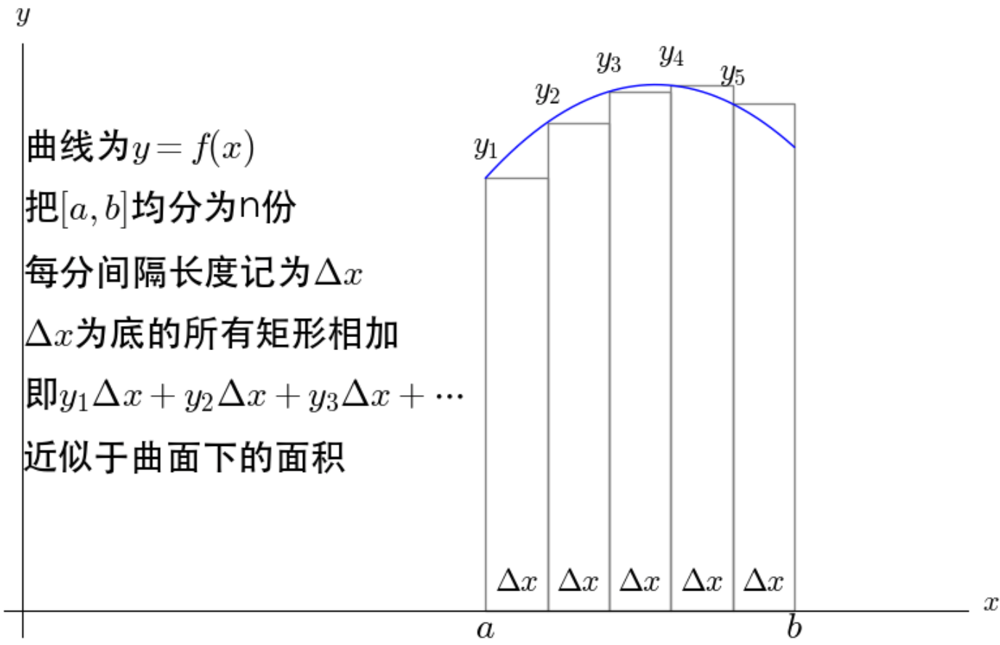
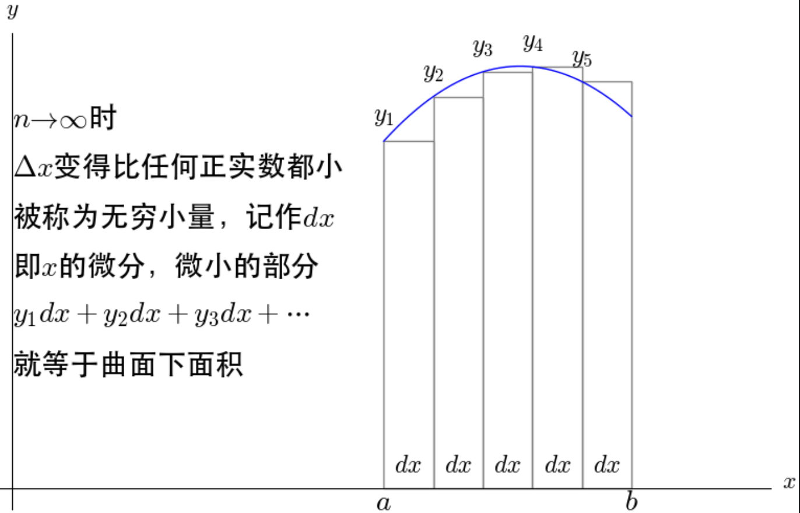
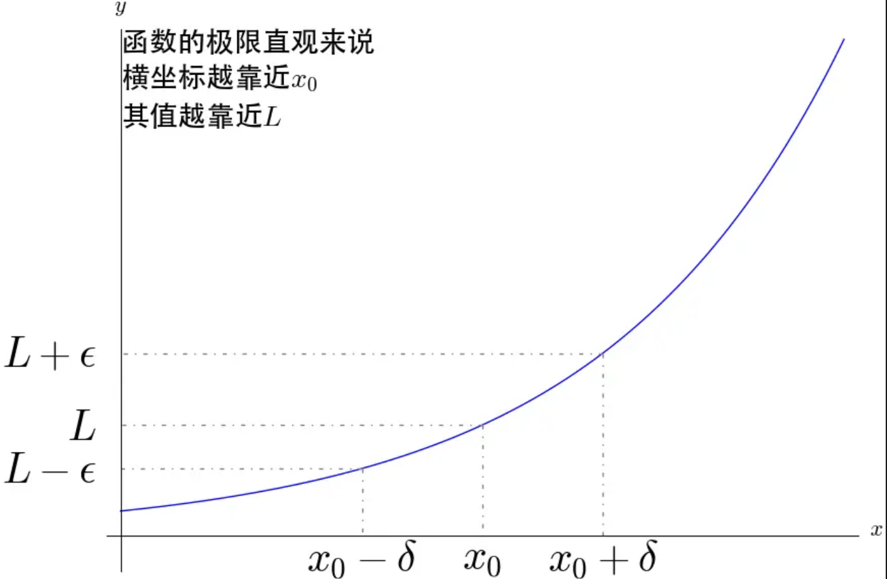
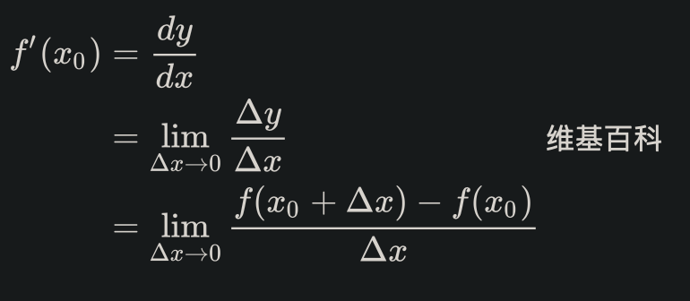
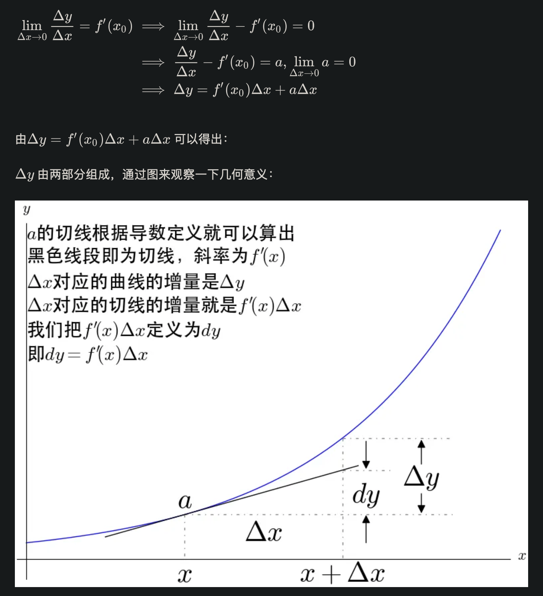
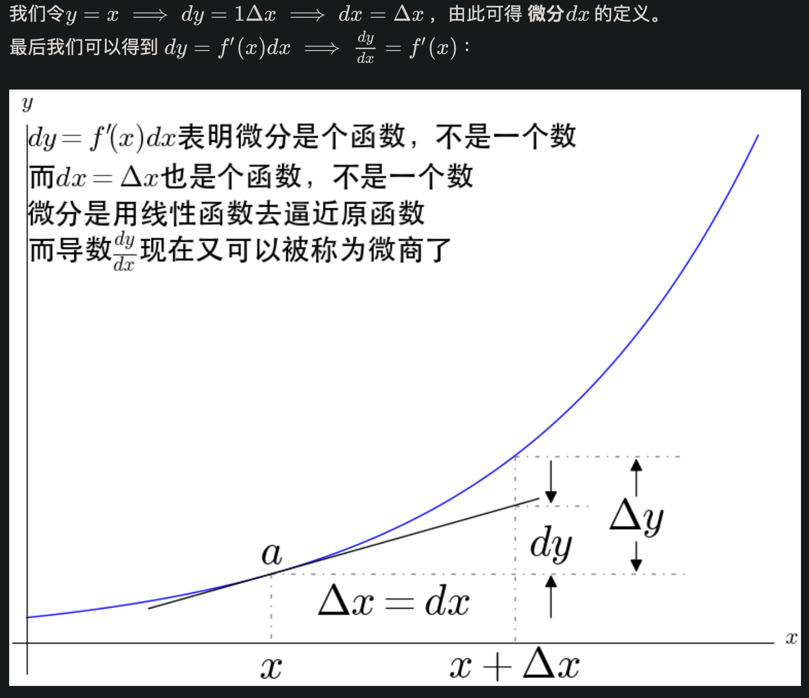

==============================
AI
==============================

这个其实是一个比较广的

- 计算机视觉
- 自然语言处理
- 推荐系统
- 搜索引擎

等

因为计算机性能发展迅速, 比较火的是 深度学习(神经网络),
说白了就是靠着算力一直算, 以前的时代配置不行,
没那个条件.

.. toctree::

  深度学习/index
  计算机视觉/index
  机器学习/index

逻辑回归和线性回归
==============================

应用领域：
  线性回归（Linear Regression）
    线性回归用于建立连续型目标变量与一个或多个自变量之间的线性关系。它通常用于预测数值型的输出，如房价预测、销售量预测等。
  逻辑回归（Logistic Regression）
    逻辑回归用于建立自变量与二元分类目标变量之间的关系。它常用于解决分类问题，如判断邮件是否为垃圾邮件、预测用户是否会购买某个产品等。

输出类型：
  线性回归
    线性回归的输出是连续的实数值。可以是任意实数，可以是正数、负数或零。
  逻辑回归
    逻辑回归的输出是概率值，表示属于某个类别的概率。通常使用sigmoid函数将线性组合的结果映射到0到1之间的概率。

模型形式：
  线性回归
    线性回归模型假设自变量与因变量之间存在线性关系。
    模型形式可以表示为::

      Y = b0 + b1X1 + b2X2 + ... + bn*Xn

    其中Y是因变量，X1, X2, ..., Xn是自变量，b0, b1, b2, ..., bn是回归系数。
  逻辑回归
    逻辑回归模型使用了sigmoid函数来建模，将线性组合的结果映射到0到1之间的概率。
    模型形式可以表示为::

      P(Y=1|X) = 1 / (1 + exp(-z))

    其中P(Y=1|X)是属于类别1的概率，z是线性组合的结果。

参数估计：
  线性回归
    线性回归通常使用最小二乘法（Ordinary Least Squares）来估计回归系数。
    目标是最小化观测值与模型预测值之间的平方差。
  逻辑回归：
    逻辑回归使用最大似然估计来估计回归系数。
    目标是最大化观测值的似然函数，即最大化观测值为实际类别的概率。

方差与标准差
==============================

方差和标准差都是用来度量数据的离散程度，即表征一组数据分布情况的统计量。

方差(variance)
  所有数据与均值之差的平方和的平均值，
  它反映了数据的波动程度，也可以用来描述一个随机变量的分布情况。

  通俗地来讲，

  - 方差越大，数据的波动就越剧烈，说明数据之间的差异越大；
  - 方差越小，数据的波动就越平稳，说明数据之间的差异越小。

  为什么取平方？
    因为随机值和均值比较出现负偏差的时候，
    要取反才能和其他值比较，为了比较方便，统一取平方值进行比较.

    不用绝对值, 是因为绝对值不可导, 没法求积分(现在数学界啥都要积分可导)
标准差(standard deviation)
  方差的平方根，它也是用来衡量数据的离散程度，
  但更直观地反映了数据与均值之间的距离，即数据的离散程度。

  - 标准差越大，数据的波动就越大，说明数据之间的差异越大；
  - 标准差越小，数据的波动就越小，说明数据之间的差异越小。

  因此，可以通过标准差来判断数据集中的数据点距离均值的程度，
  进而对数据的分布情况和变化趋势进行分析和解释。

  为什么需要标准差?
    可以简单的理解为, 方差如果带上单位, 也把单位给平方了, 比如
    单位是m, 方差因为会球平方, 单位就变成了 m^2, 开个根号利于
    与原来的数据 `xxx m` 比较.

    标准差和均值的量纲（单位）是一致的，在描述一个波动范围时标准差比方差更方便。
    比如一个班男生的平均身高是170cm,标准差是10cm,那么方差就是100cm^2。
    可以进行的比较简便的描述是本班男生身高分布是170±10cm，方差就无法做到这点。
    这么说可或许不准确, 那换种说法: 假定这个班男生的身高服从正态分布，
    则有68.3%的男生身高落在170±10cm这个区间内。
    即: 正态分布中::

      P{μ-σ<X<μ+σ}=68.3%，同理P{μ-2σ<X<μ+2σ}=95.4%，P{μ-3σ<X<μ+3σ}=99.7%    # 均可在正态分布概率表格中查询。希望有帮助。

    再举个例子，从正态分布中抽出的一个样本落在[μ-3σ, μ+3σ]这个范围内的概率是99.7%，
    也可以称为“正负3个标准差”。如果没有标准差这个概念，
    我们使用方差来描述这个范围就略微绕了一点。
    万一这个分布是有实际背景的，这个范围描述还要加上一个单位，
    这时候为了方便，人们就自然而然地将这个量单独提取出来了。
方差和标准差的区别
  - 方差只有比较意义，没有数字意义；
  - 标准差既有比较意义，也有数字意义。

  为什么要通过方差来计算标准差？
  明明是根据标准差的意义推导出的方差，
  现在计算标准差，却要先算方差？明明是我先来的，为什么会这样呢？
  因为计算方便，不用考虑不同样本值和均值的正负比较和取反，具有普遍性。

示例::

  import math

  def variance(data):
      n = len(data)
      mean = sum(data) / n
      deviations = [(x - mean) ** 2 for x in data]
      variance = sum(deviations) / n
      return variance

  def stdev(data):
      return math.sqrt(variance(data))

  data = [1, 2, 3, 4, 5]
  print("数据集：", data)
  print("方差：", variance(data))
  print("标准差：", stdev(data))

积分和微分
==============================

以下主要针对这样的一元函数::

  y = f(x)

想起以前大学的一个概念
  可导一定连续, 连续不一定可导

古典微积分, 导数
------------------------------

古典微积分求解曲线围成的面积的主要思想，就是把曲线下的面积划分成了无数个矩形面积之和

（显然）直觉告诉我们，如果  越大，则这个近似越准确

此时，无穷小量就出现了。
在 **古典微积分** 学中，无穷小量是建立微积分的基础。
莱布尼兹介绍微积分的论文就叫做《论深度隐藏的几何学及无穷小与无穷大的分析》。
在当时的观点下，无穷小量到底是什么，也是颇有争论的。
当时有数学家打比喻：“无穷小量就好比山上的灰尘，去掉和增加都没有什么影响”，很显然有人认为这是真实存在的。
在具体计算曲线下面的面积，即我们现在所说的定积分的时候，必然会遇到导数的问题，所以很自然的开始了对导数的定义和讨论。

导数的古典定义
  在曲线上取两点，连接起来所形成的直线，就称为曲线的割线：

  .. figure:: ../../resources/images/2024-02-20-09-54-51.png
    :width: 480px

  连续的割线可以反应曲线的平均变化率。

  也就是说，这一段曲线大概总的趋势是上升还是下降，上升了多少，用割线描述是并不是精确的。

  .. figure:: ../../resources/images/2024-02-20-09-55-39.png
    :width: 480px

  有了切线之后我们进一步去定义导数

  .. figure:: ../../resources/images/2024-02-20-09-57-03.png
    :width: 480px

  从这张图得出 **导数** 的定义 ::

    f'(x) = dy / dx

  而 dx 和 dy 被称为 x 和 y 的 **微分** ，都为无穷小量，

  所以导数也被莱布尼兹称为 **微商** (微分之商)

无穷小量导致的麻烦
  上图实际上是有矛盾的

  .. figure:: ../../resources/images/2024-02-20-10-00-06.png
    :width: 480px

  所以就古典微积分中切线的定义而言，微积分的基础就是不牢固的。

  无穷小量的麻烦还远远不止这一些，x^2 的导数是这样计算的:

  .. figure:: ../../resources/images/2024-02-20-10-01-32.png
    :width: 240px

  dx 先在除法中当作不为 0 的变量被约掉,
  再在最后的加法中当作 0 被忽略.

  一会是0一会又不是0。
  无穷小量和无穷小量相除为什么可以得到不一样的值？难道不应该都是1？
  无穷小量还违反了 阿基米德公理 ，这个才是更严重的缺陷，
  康托尔证明过，如果阿基米德公理被违背的话会出大问题。

  一边是看起来没有错的微积分，一边是有严重缺陷的无穷小量，这就是第二次数学危机。
  数学的严格性受到了挑战， **“对于数学，严格性不是一切，但是没有了严格性就没有了一切”。**

相关概念
  无穷小量
    在用古典微积分求解曲线围成的面积事，
    把曲线对的定义域[a,b]均分成间隔长度 ``delta x`` (这应该是三角形符号, 我没找到, 暂时直接用英文) 为n份，
    当 ``n->∞``  时， ``delta x``  变成无穷小量，记作 dx ，即 x 的 **微分**
  微分
    微分是微小的增量，即无穷小量。在古典微积分学中，无穷小量是建立微积分的基础。
  切线
    通过无穷小量定义了切线。
  导数
    导数就是切线的斜率。

基于极限重建的微积分
------------------------------

莱布尼兹、欧拉等都认识到了无穷小量导致的麻烦，
一直拼命想要修补，但这个问题等了200年后，即19世纪极限概念的清晰之后才得到解决。

解决办法是，完全摈弃无穷小量，基于极限的概念，重新建立了微积分。

可以看到，极限的描述并没有用到什么无穷小量。

**导数** 的极限定义

用极限重新严格定义了导数，此时已经脱离了微商的概念。也就是此时，导数应该被看成一个整体。
不过我们仍然可以去定义什么是微分，说到这里，真是有点剧情反转:

- 古典微积分是先定义微分再定义导数，
- 现在极限微积分是先定义了导数再有微分。

相关概念
  导数
    导数被定义为一个极限，其意义就是变化率
  微分
    微分是一个线性函数，其意义就是变化的具体数值
  切线
    有了导数之后就可以被确定下来了

参考: `<https://zhuanlan.zhihu.com/p/38337248>`_

古今微积分
------------------------------

微积分实际上被发明了两次。
古典微积分和极限微积分可以说是两个东西。我们再来比较一下古典微积分和极限微积分。

- 古典微积分是先定义微分再定义导数； 极限微积分是先定义导数再定义微分。
- 古典微积分的导数是基于无穷小量定义的； 极限微积分的导数是基于极限定义的
- 古典微积分的微分是无穷小量； 极限微积分的微分是一个线性函数。
- 古典微积分的定积分是求无穷小矩形面积的和；极限微积分的定积分是求黎曼和。
- 古典微积分的切线是画出来的； 极限微积分的切线是算出来的。
- 古典微积分的建立过程很直观； 极限微积分的建立过程更抽象。
- 古典微积分最大的好处就是很直观，不过也是因为太直观了，
  所以我们一直都无法忘记它带来的印象，也对我们理解极限微积分造成了障碍。
  也让我们在实际应用中造成了错误的理解。

加权积分
------------------------------

比如摸球, 蓝球 10 分, 红球 5 分, 最后的得分就是::

  10 * nBlue + 5 * nRed

这里 10, 5 就是权

