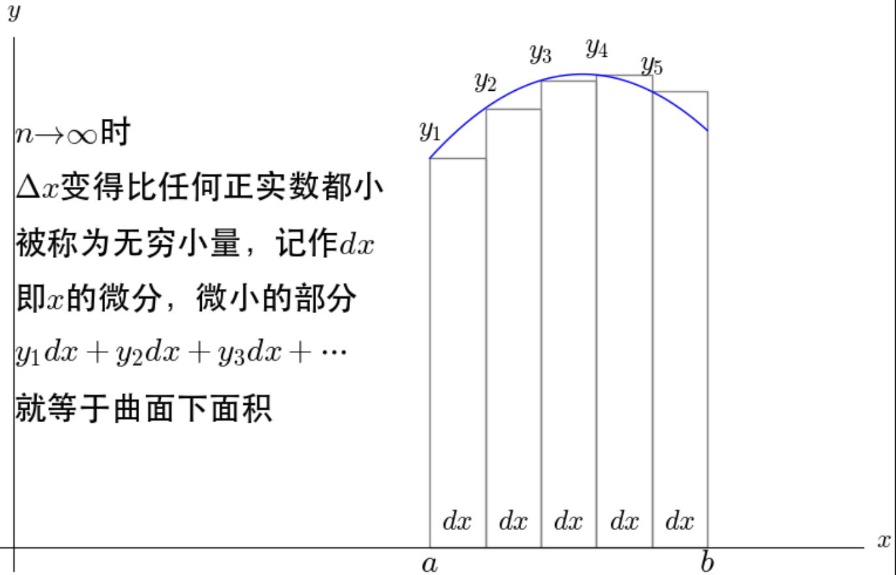
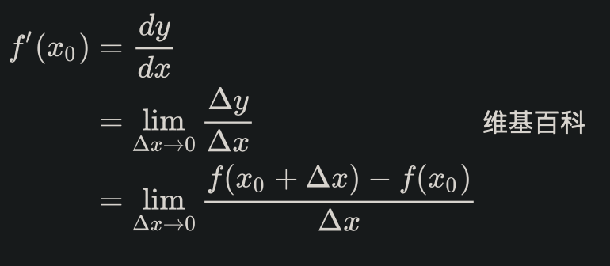
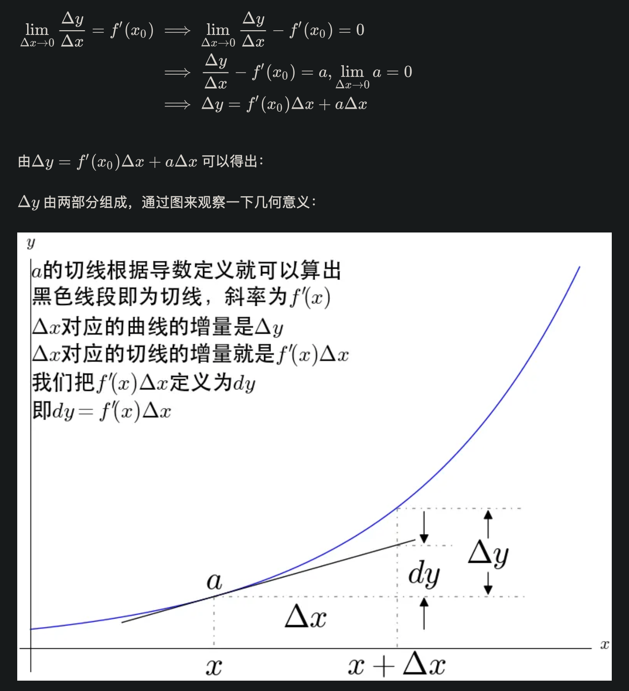

==============================
积分和微分
==============================

.. post:: 2024-03-17 00:32:12
  :tags: 数理
  :category: AI
  :author: YanQue
  :location: CD
  :language: zh-cn

以下主要针对这样的一元函数::

  y = f(x)

想起以前大学的一个概念
  可导一定连续, 连续不一定可导

古典微积分, 导数
==============================

古典微积分求解曲线围成的面积的主要思想，就是把曲线下的面积划分成了无数个矩形面积之和

.. figure:: ../../../resources/images/2024-02-20-10-09-51.png
  :width: 480px

（显然）直觉告诉我们，如果  越大，则这个近似越准确

此时，无穷小量就出现了。
在 **古典微积分** 学中，无穷小量是建立微积分的基础。
莱布尼兹介绍微积分的论文就叫做《论深度隐藏的几何学及无穷小与无穷大的分析》。
在当时的观点下，无穷小量到底是什么，也是颇有争论的。
当时有数学家打比喻：“无穷小量就好比山上的灰尘，去掉和增加都没有什么影响”，很显然有人认为这是真实存在的。
在具体计算曲线下面的面积，即我们现在所说的定积分的时候，必然会遇到导数的问题，所以很自然的开始了对导数的定义和讨论。

导数的古典定义
  在曲线上取两点，连接起来所形成的直线，就称为曲线的割线：

  .. figure:: ../../../resources/images/2024-02-20-09-54-51.png
    :width: 480px

  连续的割线可以反应曲线的平均变化率。

  也就是说，这一段曲线大概总的趋势是上升还是下降，上升了多少，用割线描述是并不是精确的。

  .. figure:: ../../../resources/images/2024-02-20-09-55-39.png
    :width: 480px

  有了切线之后我们进一步去定义导数

  .. figure:: ../../../resources/images/2024-02-20-09-57-03.png
    :width: 480px

  从这张图得出 **导数** 的定义 ::

    f'(x) = dy / dx

  而 dx 和 dy 被称为 x 和 y 的 **微分** ，都为无穷小量，

  所以导数也被莱布尼兹称为 **微商** (微分之商)

无穷小量导致的麻烦
  上图实际上是有矛盾的

  .. figure:: ../../../resources/images/2024-02-20-10-00-06.png
    :width: 480px

  所以就古典微积分中切线的定义而言，微积分的基础就是不牢固的。

  无穷小量的麻烦还远远不止这一些，x^2 的导数是这样计算的:

  .. figure:: ../../../resources/images/2024-02-20-10-01-32.png
    :width: 240px

  dx 先在除法中当作不为 0 的变量被约掉,
  再在最后的加法中当作 0 被忽略.

  一会是0一会又不是0。
  无穷小量和无穷小量相除为什么可以得到不一样的值？难道不应该都是1？
  无穷小量还违反了 阿基米德公理 ，这个才是更严重的缺陷，
  康托尔证明过，如果阿基米德公理被违背的话会出大问题。

  一边是看起来没有错的微积分，一边是有严重缺陷的无穷小量，这就是第二次数学危机。
  数学的严格性受到了挑战， **“对于数学，严格性不是一切，但是没有了严格性就没有了一切”。**

相关概念
  无穷小量
    在用古典微积分求解曲线围成的面积事，
    把曲线对的定义域[a,b]均分成间隔长度 ``delta x`` (这应该是三角形符号, 我没找到, 暂时直接用英文) 为n份，
    当 ``n->∞``  时， ``delta x``  变成无穷小量，记作 dx ，即 x 的 **微分**
  微分
    微分是微小的增量，即无穷小量。在古典微积分学中，无穷小量是建立微积分的基础。
  切线
    通过无穷小量定义了切线。
  导数
    导数就是切线的斜率。

基于极限重建的微积分
==============================

莱布尼兹、欧拉等都认识到了无穷小量导致的麻烦，
一直拼命想要修补，但这个问题等了200年后，即19世纪极限概念的清晰之后才得到解决。

解决办法是，完全摈弃无穷小量，基于极限的概念，重新建立了微积分。

.. figure:: ../../../resources/images/2024-02-20-10-14-01.png
  :width: 480px

可以看到，极限的描述并没有用到什么无穷小量。

**导数** 的极限定义

用极限重新严格定义了导数，此时已经脱离了微商的概念。也就是此时，导数应该被看成一个整体。
不过我们仍然可以去定义什么是微分，说到这里，真是有点剧情反转:

- 古典微积分是先定义微分再定义导数，
- 现在极限微积分是先定义了导数再有微分。

.. figure:: ../../../resources/images/2024-02-20-10-23-55.png
  :width: 480px

相关概念
  导数
    导数被定义为一个极限，其意义就是变化率
  微分
    微分是一个线性函数，其意义就是变化的具体数值
  切线
    有了导数之后就可以被确定下来了

参考: `<https://zhuanlan.zhihu.com/p/38337248>`_

古今微积分
==============================

微积分实际上被发明了两次。
古典微积分和极限微积分可以说是两个东西。我们再来比较一下古典微积分和极限微积分。

- 古典微积分是先定义微分再定义导数； 极限微积分是先定义导数再定义微分。
- 古典微积分的导数是基于无穷小量定义的； 极限微积分的导数是基于极限定义的
- 古典微积分的微分是无穷小量； 极限微积分的微分是一个线性函数。
- 古典微积分的定积分是求无穷小矩形面积的和；极限微积分的定积分是求黎曼和。
- 古典微积分的切线是画出来的； 极限微积分的切线是算出来的。
- 古典微积分的建立过程很直观； 极限微积分的建立过程更抽象。
- 古典微积分最大的好处就是很直观，不过也是因为太直观了，
  所以我们一直都无法忘记它带来的印象，也对我们理解极限微积分造成了障碍。
  也让我们在实际应用中造成了错误的理解。

加权积分
==============================

比如摸球, 蓝球 10 分, 红球 5 分, 最后的得分就是::

  10 * nBlue + 5 * nRed

这里 10, 5 就是权

