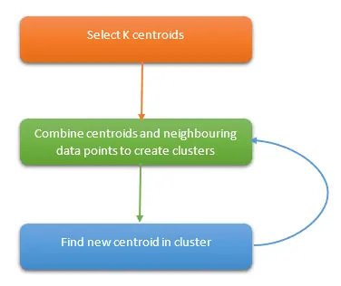

=====================================
k-平均算法 K-Means
=====================================

k-平均算法(K-Means)是一种无监督学习算法，为聚类问题提供了一种解决方案。

K-Means 算法把 n 个点（可以是样本的一次观察或一个实例）划分到 k 个集群（cluster），
使得每个点都属于离他最近的均值（即聚类中心，centroid）对应的集群。
重复上述过程一直持续到重心不改变。

