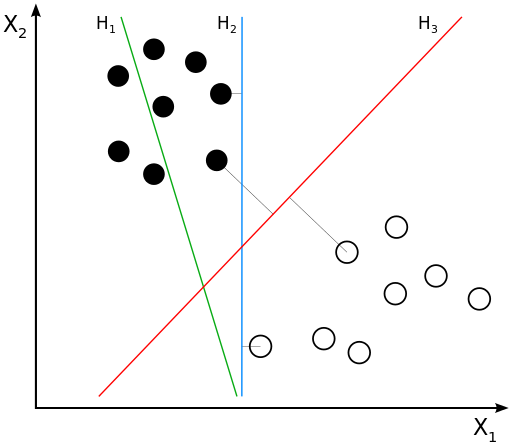
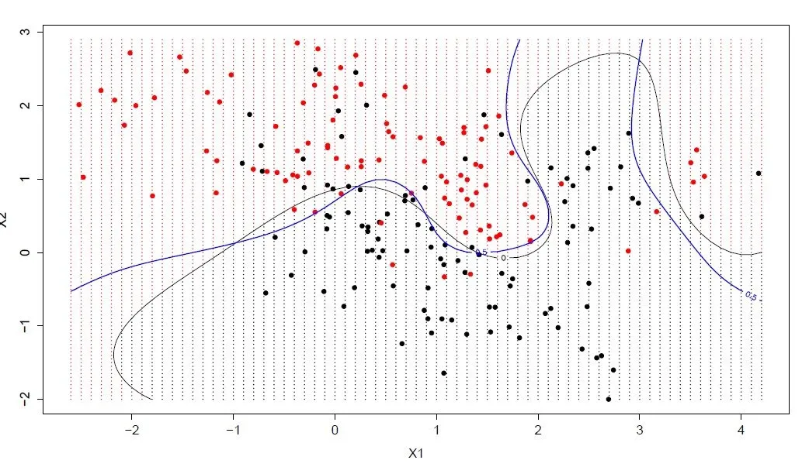
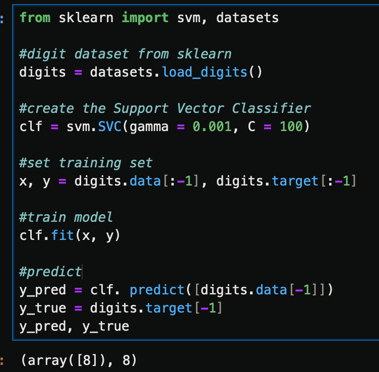

=============================================
支持向量机算法(Support Vector Machine,SVM)
=============================================

支持向量机/网络算法(SVM)属于分类型算法。

SVM模型将实例表示为空间中的点，将使用一条直线分隔数据点。
需要注意的是，支持向量机需要对输入数据进行完全标记，
仅直接适用于两类任务，应用将多类任务需要减少到几个二元问题

举例::

  from sklearn import svm, datasets

  #digit dataset from sklearn
  digits = datasets.load_digits()

  #create the Support Vector Classifier
  clf = svm.SVC(gamma = 0.001, C = 100)

  #set training set
  x, y = digits.data[:-1], digits.target[:-1]

  #train model
  clf.fit(x, y)

  #predict
  y_pred = clf. predict([digits.data[-1]])
  y_true = digits.target[-1]
  y_pred, y_true

