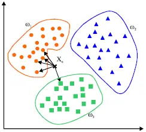
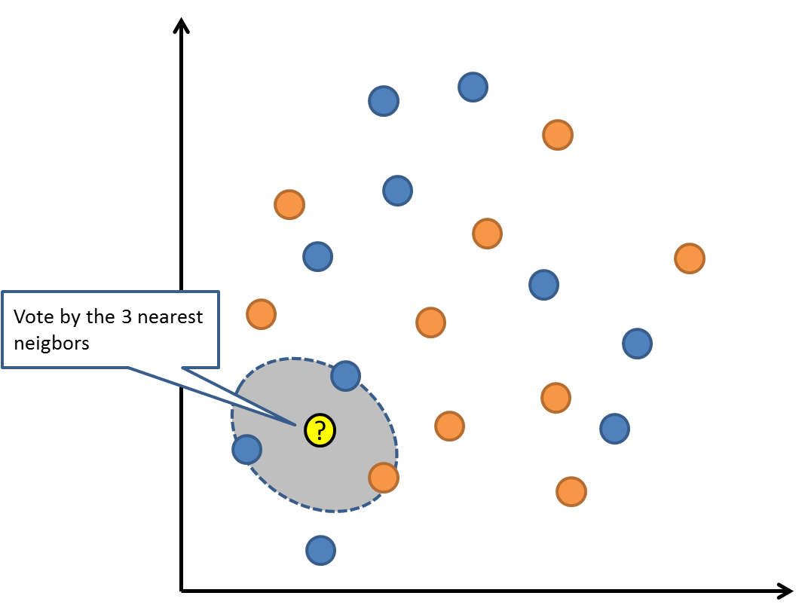
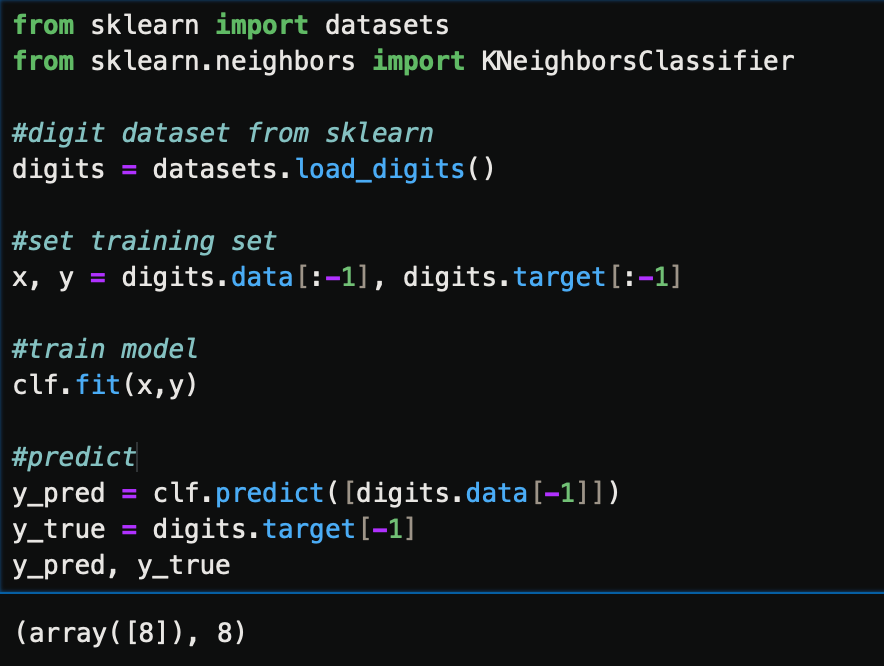
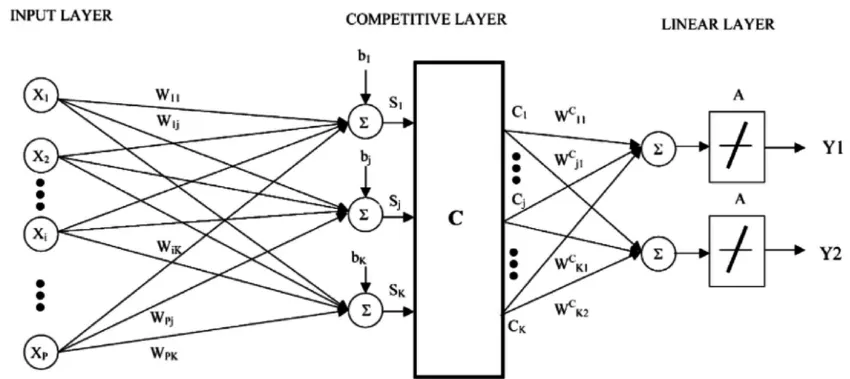

===================================================
最近邻居/k-近邻算法(K-Nearest Neighbors,KNN)
===================================================

.. note::

  属于无监督学习

KNN算法是一种基于实例的学习，或者是局部近似和将所有计算推迟到分类之后的惰性学习。
用最近的邻居（k）来预测未知数据点。
k 值是预测精度的一个关键因素，无论是分类还是回归，衡量邻居的权重都非常有用，较近邻居的权重比较远邻居的权重大

KNN 算法的缺点是对数据的局部结构非常敏感。
计算量大，需要对数据进行规范化处理，使每个数据点都在相同的范围。

举例::

  from sklearn import datasets
  from sklearn.neighbors import KNeighborsClassifier

  #digit dataset from sklearn
  digits = datasets.load_digits()

  #set training set
  x, y = digits.data[:-1], digits.target[:-1]

  #train model
  clf.fit(x,y)

  #predict
  y_pred = clf.predict([digits.data[-1]])
  y_true = digits.target[-1]
  y_pred, y_true

延伸：KNN 的一个缺点是依赖于整个训练数据集，
学习向量量化（Learning Vector Quantization，LVQ)是一种监督学习的人神经网络算法，
允许你选择训练实例。

LVQ 由数据驱动，搜索距离它最近的两个神经元，
对于同类神经元采取拉拢，异类神经元采取排斥，最终得到数据的分布模式。
如果基于 KNN 可以获得较好的数据集分类效果，
利用 LVQ 可以减少存储训练数据集存储规模。
典型的学习矢量量化算法有LVQ1、LVQ2和LVQ3，尤以LVQ2的应用最为广泛。

