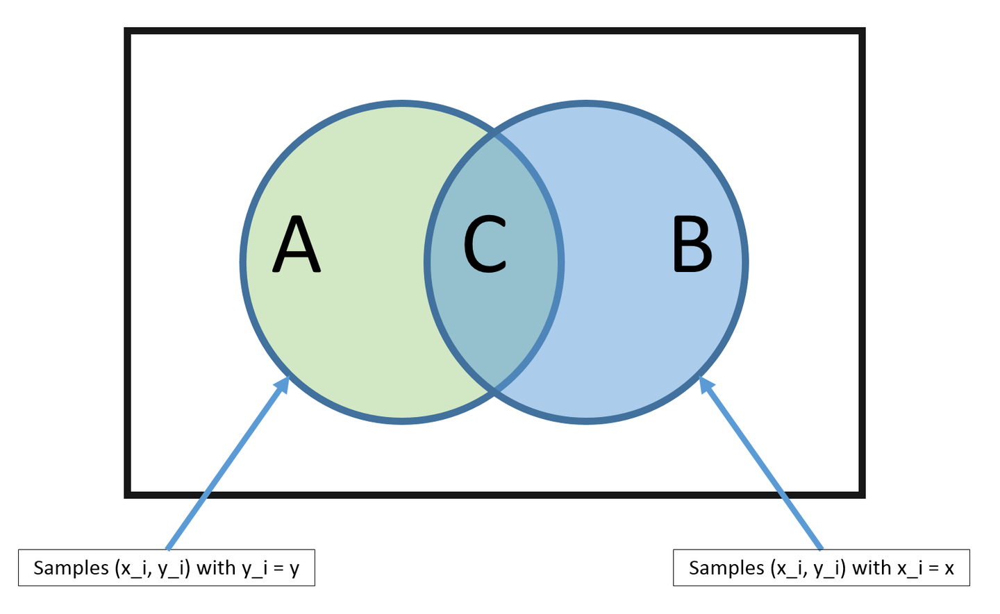

=========================================
朴素贝叶斯算法 Naive Bayes
=========================================

.. post:: 2024-03-17 00:32:12
  :tags: 机器学习, 机器学习算法
  :category: AI
  :author: YanQue
  :location: CD
  :language: zh-cn

朴素贝叶斯算法（Naive Bayes）基于概率论的贝叶斯定理，应用非常广泛，从文本分类、垃圾邮件过滤器、医疗诊断等等。
朴素贝叶斯适用于特征之间的相互独立的场景，例如利用花瓣的长度和宽度来预测花的类型。
“朴素”的内涵可以理解为特征和特征之间独立性强。

与朴素贝叶斯算法密切相关的一个概念是最大似然估计(Maximum likelihood estimation)，
历史上大部分的最大似然估计理论也都是在贝叶斯统计中得到大发展。
例如，建立人口身高模型，很难有人力与物力去统计全国每个人的身高，
但是可以通过采样，获取部分人的身高，然后通过最大似然估计来获取分布的均值与方差。

.. note::

  Naive Bayes is called naive because it assumes that each input variable is independent.

