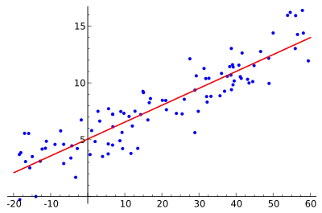

==================================================
线性回归算法 Linear Regression
==================================================

.. post:: 2024-03-17 00:32:12
  :tags: 机器学习, 机器学习算法
  :category: AI
  :author: YanQue
  :location: CD
  :language: zh-cn

回归分析(Regression Analysis)是统计学的数据分析方法，
目的在于了解两个或多个变量间是否相关、相关方向与强度，
并建立数学模型以便观察特定变量来预测其它变量的变化情况。

线性回归算法(Linear Regression)的建模过程就是使用数据点来寻找最佳拟合线。
公式::

  y = mx + c

其中 y 是因变量，x 是自变量，利用给定的数据集求 m 和 c 的值。
线性回归又分为两种类型，即

- **简单线性回归** (simple linear regression)，只有 1 个自变量；
- **多变量回归** (multiple regression)，至少两组以上自变量。

