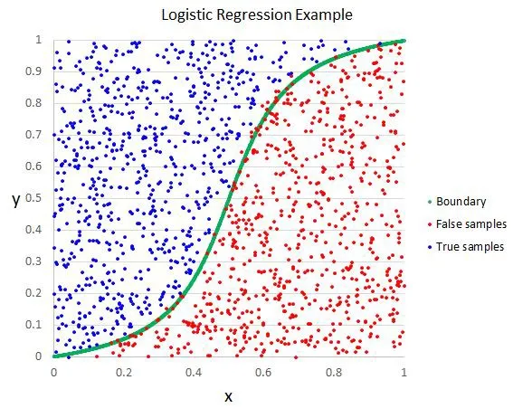

=================================================
逻辑回归算法 Logistic Regression
=================================================

.. post:: 2024-03-17 00:32:12
  :tags: 机器学习, 机器学习算法
  :category: AI
  :author: YanQue
  :location: CD
  :language: zh-cn

逻辑回归算法(Logistic Regression)一般用于需要明确输出的场景，如某些事件的发生(预测是否会发生降雨)。
通常，逻辑回归使用某种函数将概率值压缩到某一特定范围。

例如，Sigmoid 函数(S 函数)是一种具有 S 形曲线、用于二元分类的函数。
它将发生某事件的概率值转换为 0, 1 的范围表示::

  Y = E ^ (b0＋b1 x) / (1 + E ^ (b0＋b1 x ) )

以上是一个简单的逻辑回归方程，B0，B1是常数。这些常数值将被计算获得，以确保预测值和实际值之间的误差最小。

