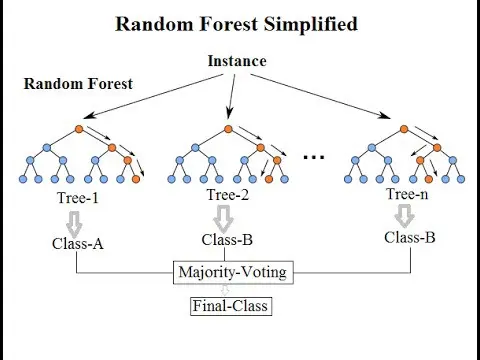
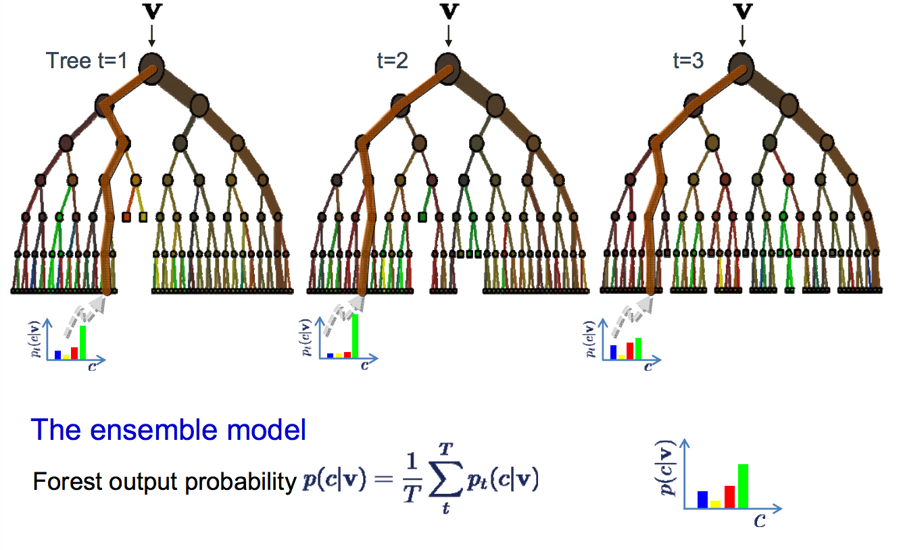

================================
随机森林算法 Random Forest
================================

.. post:: 2024-03-17 00:32:12
  :tags: 机器学习, 机器学习算法
  :category: AI
  :author: YanQue
  :location: CD
  :language: zh-cn

属于集成学习

随机森林算法（Random Forest）的名称由 1995 年由贝尔实验室提出的random decision forests 而来，
正如它的名字所说的那样，随机森林可以看作一个决策树的集合。

随机森林中每棵决策树估计一个分类，这个过程称为“投票（vote）”。
理想情况下，我们根据每棵决策树的每个投票，选择最多投票的分类。

可以参考文档: `<https://www.stat.berkeley.edu/~breiman/randomforest2001.pdf>`_

本地文档: :download:`../../../../resources/pdf/randomforest2001.pdf`

