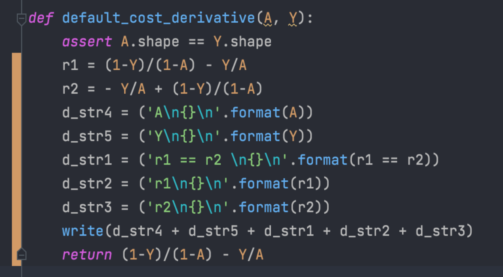
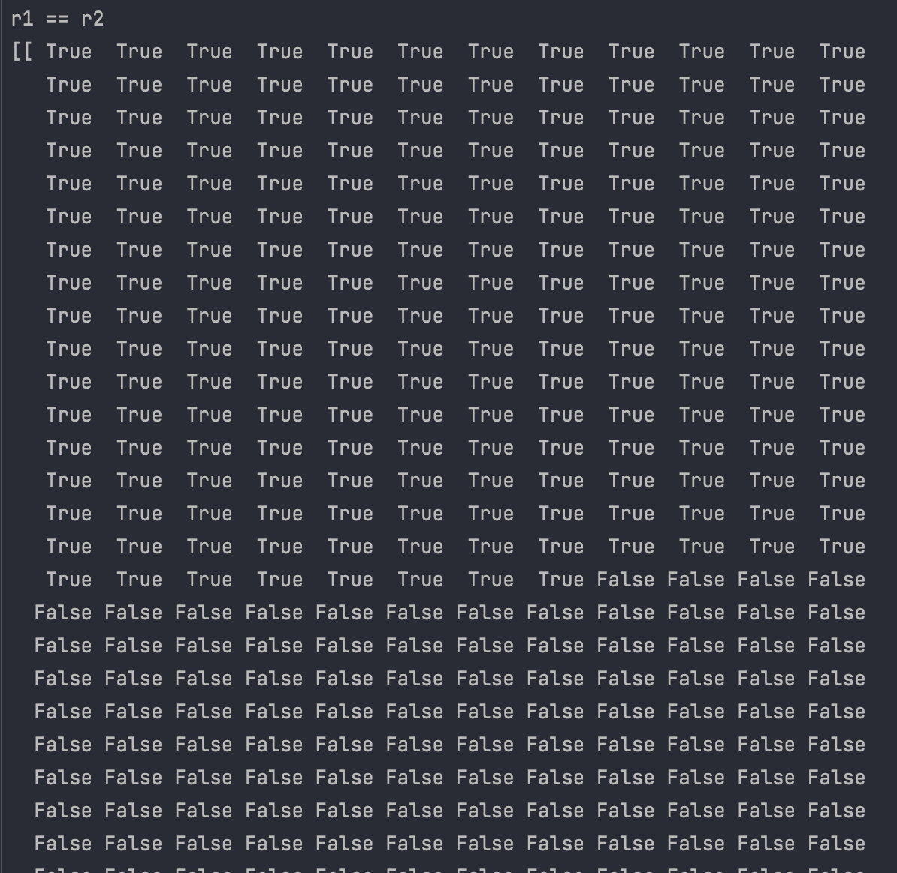
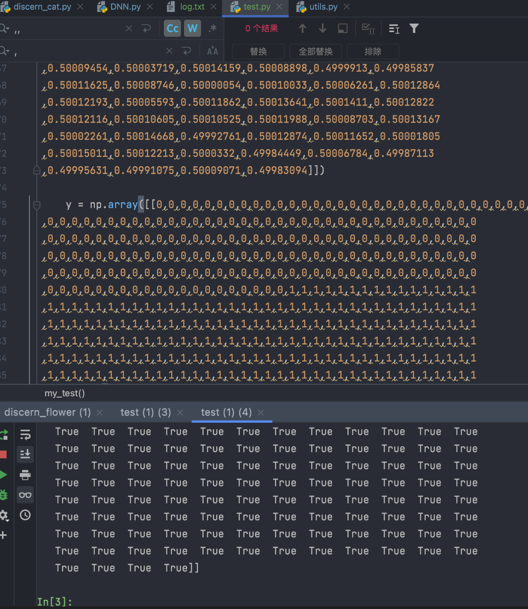

===============================
深度学习
===============================

.. toctree::

  贝叶斯
  风格迁移
  卡尔曼滤波
  模型训练可视化模块
  人脸识别
  图像识别
  自然语言处理
  DNN
  数据预处理

卷积
===============================

信号分析
  一个输入信号f(t)，经过一个线性系统（其特征可以用单位冲击响应函数g(t)描述）以后，
  输出信号应该是什么？实际上通过卷积运算就可以得到输出信号。
图像处理
  输入一幅图像f(x,y)，经过特定设计的卷积核g(x,y)进行卷积处理以后，输出图像将会得到模糊，边缘强化等各种效果。

- 卷积的“卷”，指的的函数的翻转，从 g(t) 变成 g(-t) 的这个过程；
  同时，“卷”还有滑动的意味在里面（吸取了网友李文清的建议）。
  如果把卷积翻译为“褶积”，那么这个“褶”字就只有翻转的含义了。
- 卷积的“积”，指的是积分/加权求和。

对卷积的意义的理解：
  从“积”的过程可以看到，我们得到的叠加值，是个全局的概念。

  以信号分析为例，卷积的结果是不仅跟当前时刻输入信号的响应值有关，
  也跟过去所有时刻输入信号的响应都有关系，考虑了对过去的所有输入的效果的累积。

  在图像处理的中，卷积处理的结果，其实就是把每个像素周边的，
  甚至是整个图像的像素都考虑进来，对当前像素进行某种加权处理。
  所以说，“积”是全局概念，或者说是一种“混合”，把两个函数在时间或者空间上进行混合。

  那为什么要进行“卷”？直接相乘不好吗？
    进行“卷”（翻转）的目的其实是施加一种约束，
    它指定了在“积”的时候以什么为参照。
    在信号分析的场景，它指定了在哪个特定时间点的前后进行“积”，
    在空间分析的场景，它指定了在哪个位置的周边进行累积处理。

- 参考: `如何通俗易懂地解释卷积？ <https://www.zhihu.com/question/22298352>`_
- 本地PDF: :download:`../../../resources/pdf/如何通俗易懂地解释卷积？ - 知乎.pdf`

一次重构自己的一个DNN模型发现的问题
==============================================================

交叉墒损失函数引起的bug
-------------------------------

重构的时候发现一个bug

感觉是python底层解析执行的问题，向量化计算会失败, 出bug代码

向量化的计算结果与实际不一致

bug示例，部分截图

有意思的是，专门写了一个测试把原有数据拿去测试，居然复现不出

排查到凌晨，发现是这个问题。。。具体原因还没找到，只找到bug点。

先记录一下，以后再研究

