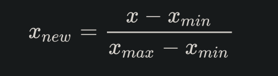
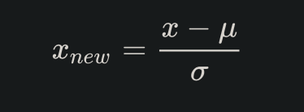

=================================
数据预处理
=================================

.. post:: 2024-03-17 00:32:12
  :tags: 深度学习
  :category: AI
  :author: YanQue
  :location: CD
  :language: zh-cn

数据的归一化和标准化是特征缩放(feature scaling)的方法，
是数据预处理的关键步骤。
不同评价指标往往具有不同的量纲和量纲单位，
这样的情况会影响到数据分析的结果，
为了消除指标之间的量纲影响，需要进行数据归一化/标准化处理，
以解决数据指标之间的可比性。
原始数据经过数据归一化/标准化处理后，各指标处于同一数量级，适合进行综合对比评价。

归一化/标准化实质是一种线性变换，线性变换有很多良好的性质，
这些性质决定了对数据改变后不会造成“失效”，反而能提高数据的表现，
这些性质是归一化/标准化的前提。
比如有一个很重要的性质：线性变换不会改变原始数据的数值排序。

优点

-  归一化/标准化后可以加快梯度下降的求解速度
-  避免局部值偏差太大

归一化
=================================

**归一化（Normalization）**

归一化一般是将数据映射到指定的范围，用于去除不同维度数据的量纲以及量纲单位。

在机器学习领域中，不同评价指标（即特征向量中的不同特征就是所述的不同评价指标）往往具有不同的量纲和量纲单位，这样的情况会影响到数据分析的结果，

为了消除指标之间的量纲影响，需要进行数据标准化处理，
以解决数据指标之间的可比性。原始数据经过数据标准化处理后，
各指标处于同一数量级，适合进行综合对比评价。其中，最典型的就是数据的归一化处理。

常见的映射范围有 [0, 1] 和 [-1, 1] ，最常见的归一化方法就是 Min-Max 归一化。

Min-Max 归一化
----------------------------------

Min-Max 归一化（Min-Max Normalization）

也称为离差标准化，是对原始数据的线性变换，使结果值映射到[0 - 1]之间。转换函数如下：

其中max为样本数据的最大值，min为样本数据的最小值。
这种归一化方法比较适用在数值比较集中的情况。
但是，如果max和min不稳定，很容易使得归一化结果不稳定，使得后续使用效果也不稳定，
实际使用中可以用经验常量值来替代max和min。
而且当有新数据加入时，可能导致max和min的变化，需要重新定义。

作用：

- 数据映射到指定的范围内进行处理，更加便捷快速。
- 把有量纲表达式变成无量纲表达式，便于不同单位或量级的指标能够进行比较和加权。
  经过归一化后，将有量纲的数据集变成纯量，还可以达到简化计算的作用。

.. note::

  有时候我们希望将输入转换到[-1,1]的范围，可以使用以下的公式:

  .. figure:: ../../../resources/images/2024-02-19-15-14-45.png
    :width: 240px

  实质上，归一化的一般规范函数是::

    y = (ymax-ymin)*(x-xmin)/(xmax-xmin) + ymin。

标准化
=================================

**标准化（Normalization）**

.. note::

  归一化和标准化的英文翻译是一致的，但是根据其用途（或公式）的不同去理解（或翻译）

标准化是依照特征矩阵的列处理数据。
数据标准化方法有多种，
如：直线型方法(如极值法、标准差法)、折线型方法(如三折线法)、曲线型方法(如半正态性分布)。
不同的标准化方法，对系统的评价结果会产生不同的影响。其中，最常用的是Z-Score 标准化。

Z-Score 标准化
----------------------------------

Z-Score 标准化（Z-Score Normalization）

这种方法给予原始数据的均值（mean）和标准差（standard deviation）进行数据的标准化。
经过处理的数据符合标准正态分布，即均值为0，标准差为1，转化函数为

其中 u 是样本数据的均值（mean），
o 是样本数据的标准差（std）。
此外，标准化后的数据保持异常值中的有用信息，
使得算法对异常值不太敏感，这一点归一化就无法保证。

作用:

- 提升模型的收敛速度（加快梯度下降的求解速度）
- 提升模型的精度（消除量级和量纲的影响）
- 简化计算（与归一化的简化原理相同）

归一化和标准化的异同
=================================

区别
  - 归一化是将样本的特征值转换到同一量纲下把数据映射到[0,1]或者[-1, 1]区间内，
    仅由变量的极值决定，因区间放缩法是归一化的一种。
  - 标准化是依照特征矩阵的列处理数据，其通过求z-score的方法，
    转换为标准正态分布，和整体样本分布相关，每个样本点都能对标准化产生影响。
相同
  它们的相同点在于都能取消由于量纲不同引起的误差；
  都是一种线性变换，都是对向量X按照比例压缩再进行平移。

归一化和标准化的适用场景
=================================

- 数据的分布本身就服从正态分布，使用Z-Score标准化
- 有离群值的情况：使用Z-Score

  这里不是说有离群值时使用Z-Score不受影响，
  而是，Min-Max对于离群值十分敏感，因为离群值的出现，
  会影响数据中max或min值，从而使Min-Max的效果很差。
  相比之下，虽然使用Z-Score计算方差和均值的时候仍然会受到离群值的影响，
  但是相比于Min-Max法，影响会小一点

- 如果对输出结果范围有要求，用归一化
- 如果数据较为稳定，不存在极端的最大最小值，用归一化
- 如果数据存在异常值和较多噪音，用标准化，可以间接通过中心化避免异常值和极端值的影响

非线性变换
=================================

非线性变换经常用在数据分化比较大的场景，有些数值很大，有些很小。通过一些数学函数，将原始值进行映射。该方法包括 log、指数，正切等。需要根据数据分布的情况，决定非线性函数的曲线，比如log(V, 2)还是log(V, 10)等。

对数函数转换::

  y = log10(x)

反余切函数转换::

  y = atan(x) * 2 / π

:参考::
  - `数据预处理：归一化和标准化 <https://zhuanlan.zhihu.com/p/296252799>`_
  - `如何理解归一化（normalization） <https://zhuanlan.zhihu.com/p/424518359>`_

