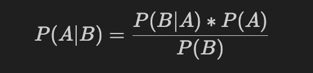

=========================
贝叶斯
=========================

贝叶斯定理由英国数学家贝叶斯 ( Thomas Bayes 1702-1761年) 发展，
用来描述两个条件概率之间的关系，比如::

  P(A|B) 和 P(B|A)

按照乘法法则，可以立刻导出::

  P(A∩B) = P(A)*P(B|A)=P(B)*P(A|B)

如上公式也可变形为::

  P(A|B)=P(B|A)*P(A)/P(B)

得到 **事件A在事件B(发生)的条件下的概率**

贝叶斯公式又被称为贝叶斯定理,
贝叶斯规则是概率统计中的应用所观察到的现象对有关概率分布的主观判断（即先验概率）进行修正的标准方法。

公式

其中，P(A)可以称之为先验概率，P(A|B)是后验概率

应用场景：某些情况下很难得到  P(A|B)，所有根据别的来算

例子, 现分别有 A、B 两个容器，
在容器 A 里分别有 7 个红球和 3 个白球，
在容器 B 里有 1 个红球和 9 个白球，
现已知从这两个容器里任意抽出了一个红球，问这个球来自容器 A 的概率是多少?

假设已经抽出红球为事件 B，
选中容器 A 为事件 A，
则有::

  P(B) = 8/20
  P(A) = 1/2
  P(B|A) = 7/10

按照公式，则有::

  P(A|B) = (7/10)*(1/2) / (8/20) = 0.875

参考: `百度百科-贝叶斯 <https://baike.baidu.com/item/贝叶斯公式/9683982>`_

正向概率与逆向概率
=========================

正向概率

| 假设袋子有N个白球，M个黑球，求摸一次为黑球的概率

逆向概率

| 如果我们事先不知道袋子里面黑白球比例，而是随机摸出一个（或几个）球，观察这些取出球的颜色，可以对袋子中黑白球的比例做出一个预测

