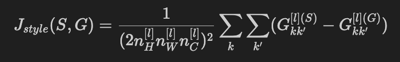

=============================
风格迁移
=============================

.. post:: 2024-03-17 00:32:12
  :tags: 深度学习
  :category: AI
  :author: YanQue
  :location: CD
  :language: zh-cn

隶属于图像操作

.. note::

  时隔两年, 已经忘了这些东西是啥玩意儿了

代价函数定义
=============================

图片一 C，	图片二 S， 风格迁移后的图片 G

- 内容代价函数

  .. figure:: ../../../resources/images/2024-02-19-10-01-27.png
    :width: 240px

- 风格代价函数

  .. figure:: ../../../resources/images/2024-02-19-10-01-57.png
    :width: 240px

注： i, j, k 表示高，宽，通道

- 总代价函数

  .. figure:: ../../../resources/images/2024-02-19-10-03-00.png
    :width: 240px

更新的是生成图像的像素点的值
=============================

