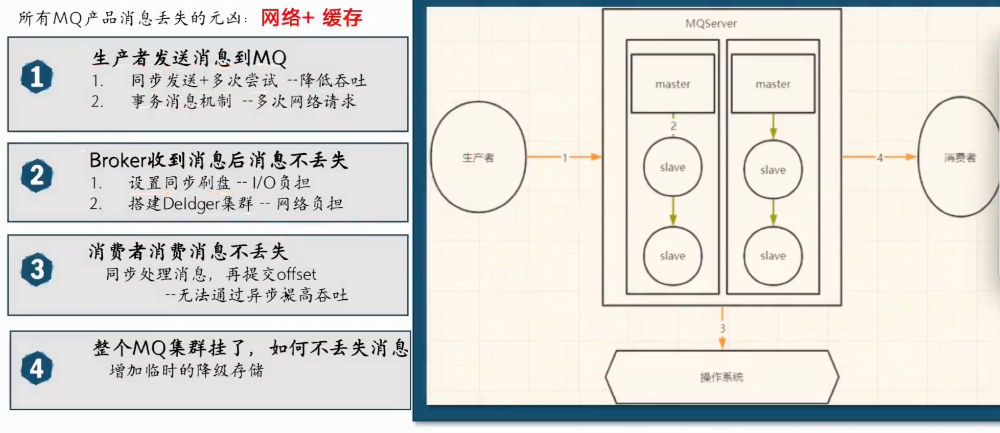

=========================
RocketMQ
=========================

如何避免消息丢失
=========================

方案一：同步发送＋多次重试
  DefaultMQProducer发送消息的方式

  - 单向发送：消息发出去就不管了
  - 同步发送：同步等待Broker响应
  - 异步发送：异步处理Broker通知
  - 重试队列与死信队列保证消息安全
方案二：RocketMQ提供的事务消息机制
  TransactionMQProducer + TransactionListenerImpl
  实现事务消息发送

  .. figure:: ../../../resources/images/2024-02-14-17-42-06.png
    :width: 480px

关于缓存写到磁盘
  RocketMQ

  - 同步刷盘, 每10毫秒进行一次刷盘;
  - 异步刷盘，

    - 如果是堆内内存，可以设定刷盘的间隔;
    - 堆外内存，只管写入pagecache，由操作系统进行刷盘。

.. note::

  pagecache 指内核态的页缓存

整个链路保障消息一致
=========================

如果每一个地方都要保障消息不丢失, 性能会下降,
甚至还不如不用MQ.

所以, 综合考虑使用场景...
