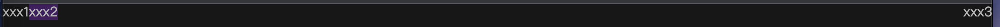

==========================
css常见使用技巧
==========================

元素从左到右排列
==========================

这些从左到右的元素设置 `display` 为 `flex` 即可::

  .container {
    display: flex;
  }

在这个基础上, 如果要再实现最后一个元素靠右, 那么可以::

  .item-right {
      /* 会移动到最右边 */
      margin-left: auto;
  }

div结构::

  

    xxx1
    
xxx2

    
xxx3

  

  效果

