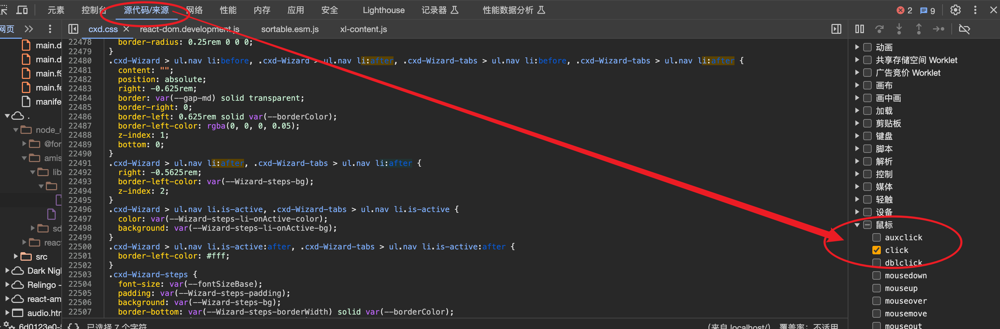

===============================
css
===============================

.. toctree::
  :maxdepth: 1

  ./各种选择器
  ./css常用属性
  ./css常见使用技巧
  ./宽度-高度百分比说明
  ./元素的出场顺序
  伪类

一些伪类选择器
===============================

- hover: 鼠标悬停
- focus: 元素获取焦点(如input键盘选中)
- active: 元素激活, 这个没怎么理解

none与unset区别
===============================

- none: 指定没有样式的值或属性. 它常用于清除或禁用某个样式属性的效果
- unset: 将样式属性重置为其默认值. 它会将属性值重置为浏览器默认值或继承值，
  根据具体属性的默认行为而定。使用 "unset" 可以撤销已应用的样式，并将其恢复为初始状态

像素单位
===============================

rem
  rem 是相对于根元素（即 <html> 元素）的字体大小来计算的单位
px
  px 是固定的像素单位
em
  类似于 rem，
  em 也是相对于父元素的字体大小计算的单位。
  不同之处在于，em 是相对于最近的父级元素的字体大小来计算的。
  如果没有显式设置父元素的字体大小，em 单位将继承自上级元素的字体大小。
\%
  百分比单位是相对于父元素的尺寸来计算的。
  例如，设置一个元素的宽度为 50%，表示该元素的宽度将是其父元素宽度的一半。
vw 和 vh
  vw 和 vh 分别表示视口宽度（Viewport Width）和视口高度（Viewport Height）的百分比单位。
  例如，1vw 表示视口宽度的 1%。这些单位用于创建响应式布局，可以根据视口的大小来确定元素的尺寸。
ex（相对于小写字母 "x" 的高度）、ch（相对于数字 "0" 的宽度）等
  这些单位相对于字体相关的尺寸进行计算。
绝对单位
  除了相对单位，CSS 还支持一些绝对单位，如 cm（厘米）、mm（毫米）、in（英寸）、pt（磅）等。
  这些单位在打印和物理媒体方面比较常用。

导入其他css
===============================

比如在 theme.css 中导入 checkbox.css::

  /* theme.css */
  @import url(checkbox.css);

chrome支持前端断点
===============================

比如按钮点击后的断点

