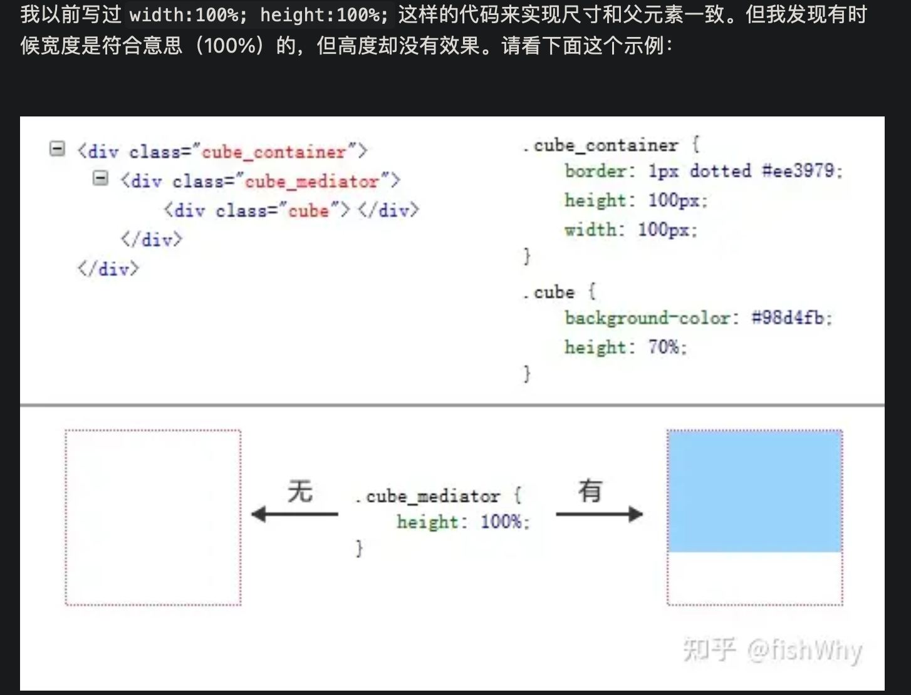

=======================================
宽度-高度百分比说明
=======================================

.. post:: 2023-02-20 22:06:49
  :tags: css
  :category: 前端
  :author: YanQue
  :location: CD
  :language: zh-cn

关于height这种设置的属性为百分比计算
============================================

一般情况下, 不为绝对定位时候是使用父元素的宽高计算的.
更确切地说是 `包含块`: **父元素的内容区（盒模型里的content）**

实际生效的具体值的计算方式为::

  元素的包含块大小 * 设定的百分比

.. note::

  一般情况下, 不是绝对定位元素( position: absolute | fixed)、根元素 html 以及根字体, 元素的包含块就是父元素

什么是元素的包含块?
  元素的包含块是指元素用来计算和定位的一个框;

  对于开启绝对定位的元素来说，其包含块是离它最近的开启了定位（且position不为static）的祖先元素;
  如果所有的祖先元素都没有开启定位，则其包含块就是初始包含块;

  一般情况下，根元素（在很多场景下可以看成<html>）被称为初始包含块，其尺寸等同于浏览器可视窗口的大小;
  对于其他元素，如果该元素的position是relative或者static，则包含块由其最近的块级祖先元素content box边界形成;
  如果元素的position为fixed，则包含块是初始包含块;
  如果元素position为absolute，则包含块由最近的position不为static的祖先元素建立;

有时候会发现设置的高度没有生效

原因是: 当一个元素的高度使用百分比值，
如果其包含块没有明确的高度定义（也就是说，取决于内容高度），
且这个元素不是绝对定位，则该百分比值等同于auto。auto是初始默认值，所以看起来就像是“失效”了。

.. sidebar::

  此部分参考: https://zhuanlan.zhihu.com/p/394791528

  示例
