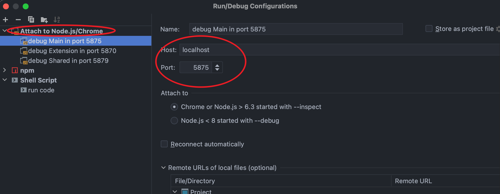
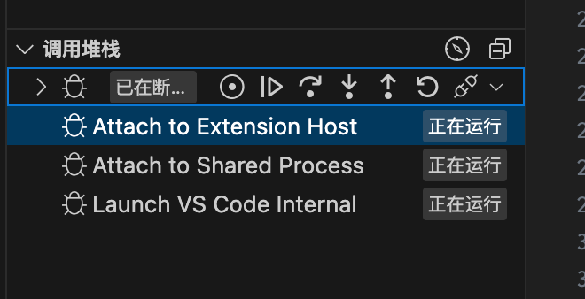

=============================
node启动常见参数
=============================

--remote-debug-port=<port>
  旧版调试参数; 使用旧的 Legacy 协议,功能较少
--inspect=<port>
  新版支持调试参数;
  当使用node时, 有时候需要启动断点调试功能,
  这个时候可以使用此参数, 然后在这个端口进行调试;
  可以在 Chrome 浏览器中通过 `chrome://inspect` 访问调试地址
--inspect-brk=<port>
  当使用node时, 有时候需要启动断点调试功能,
  这个时候可以使用此参数, 然后在这个端口进行调试;

  与 `--inspect` 相比, 会在启动时暂停

端口调试工具
=============================

**WebStorm VS VSCode**

WebStorm仅支持单个端口的调试:

而VSCode支持多端口同时多断点启动:

