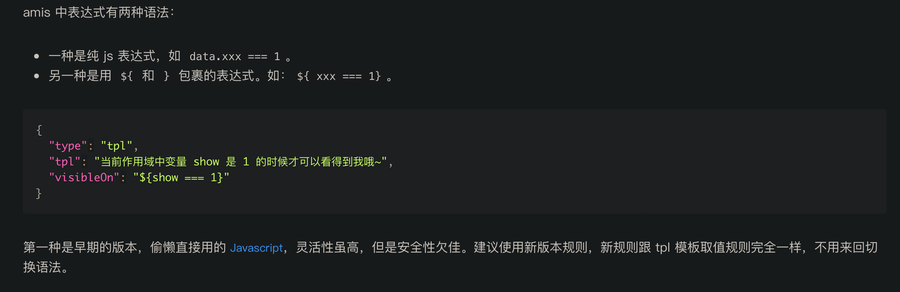

===========================
变量使用
===========================

.. post:: 2023-03-01 00:19:35
  :tags: 框架, amis, 问题
  :category: 前端
  :author: YanQue
  :location: CD
  :language: zh-cn

若变量名不存在特殊字符时, 可以直接使用::

  $varName

若存在特殊字符或者下划线或者表达式等, 需要括起来才能正常识别位数据域数据::

  ${varName}

所以一般建议统一加上花括号

另外对于表达式而言, 不加花括号是旧版直接用js,
可参考: `<https://aisuda.bce.baidu.com/amis/zh-CN/docs/concepts/expression>`_

github也有相关问题 `<https://github.com/baidu/amis/issues/9629>`_

