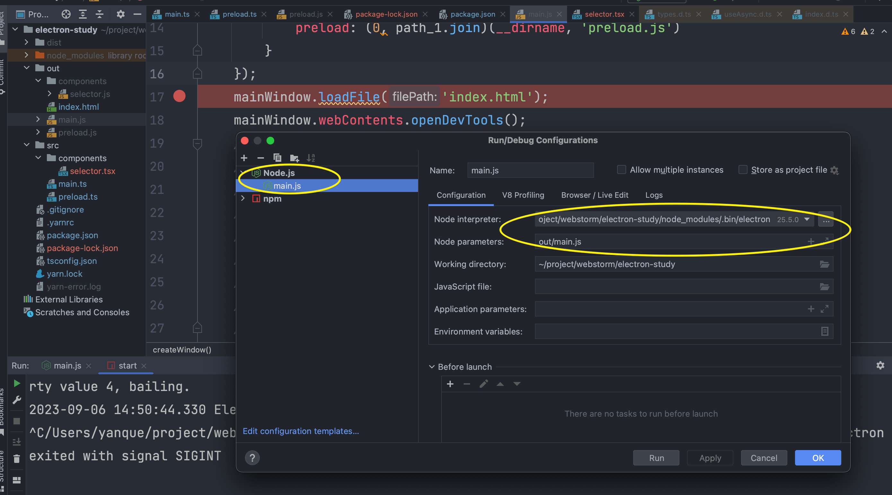

=====================================
webstrom中如何进行调试
=====================================

主要针对ts项目

因为ts需要编译成js使用, 所以断点需要打在编译后的js文件内

命令行触发浏览器调试
=====================================

有个 electron 有个内置的开启debug, 直接命令触发::

  ./node_modules/.bin/electron . --inspect

其中 `--inspect` 可以跟端口(默认9229)::

  --inspect=8888

启动后, 在 Chrome 浏览器（或其他基于 Chromium 开发的浏览器）
中打开 `chrome://inspect` 即可看到对应的调试会话

webstrom开启调试
=====================================

如下配置

其中参数 `out/main.js` 是编译好的入口文件.

注意解释器需要选 `electron` 的路径

这时候把断点打在相应的js文件并点击小虫子即可开启调试

若需要直接上面的在浏览器中调试, 增加参数即可::

  --remote-debugging-port=9222

.. note::

  直接点击 package.json 启动是无法进行调试的.
