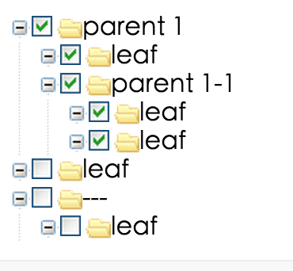

===============================
一些好用的react库
===============================

react-tooltip
===============================

安装::

  npm i react-tooltip

用于 **鼠标移入** 时候的提示显示::

  

      <a data-tooltip-id="my-tooltip" data-tooltip-content="Hello world!">
          ◕‿‿◕
      </a>
      <Tooltip id='my-tooltip'></Tooltip>
  

  效果

rc-tree
===============================

官网: `https://www.npmjs.com/package//rc-tree`

安装::

  npm i rc-tree

  效果

