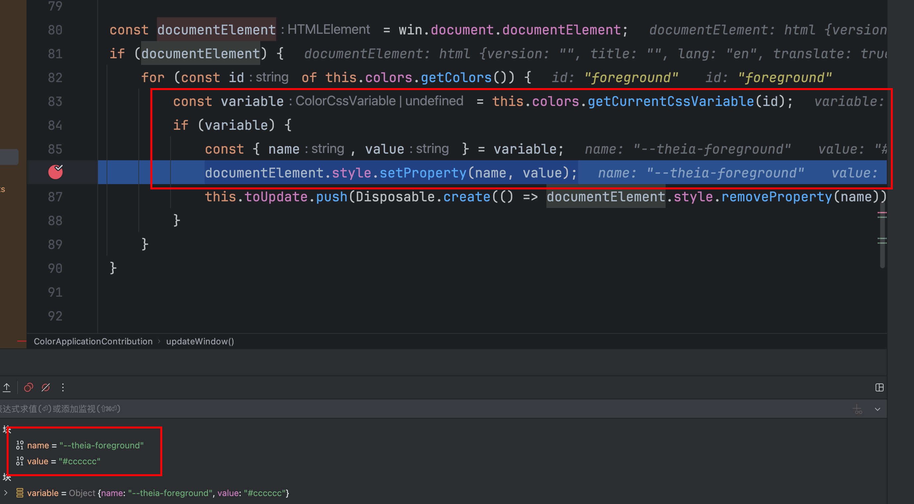

===================================
多主题
===================================

主要::

  node_modules/@theia/core/src/browser/theming.ts

下定义的 ThemeService 服务.

在 init 方法中注册了默认主题::

  protected init(): void {
    this.register(...BuiltinThemeProvider.themes);
    ...

可以看到默认主题定义::

  export class BuiltinThemeProvider {

      static readonly darkTheme: Theme = {
          id: 'dark',
          type: 'dark',
          label: 'Dark (Theia)',
          editorTheme: 'dark-theia' // loaded in /packages/monaco/src/browser/textmate/monaco-theme-registry.ts
      };

      static readonly lightTheme: Theme = {
          id: 'light',
          type: 'light',
          label: 'Light (Theia)',
          editorTheme: 'light-theia' // loaded in /packages/monaco/src/browser/textmate/monaco-theme-registry.ts
      };

      static readonly hcTheme: Theme = {
          id: 'hc-theia',
          type: 'hc',
          label: 'High Contrast (Theia)',
          editorTheme: 'hc-theia' // loaded in /packages/monaco/src/browser/textmate/monaco-theme-registry.ts
      };

      static readonly hcLightTheme: Theme = {
          id: 'hc-theia-light',
          type: 'hcLight',
          label: 'High Contrast Light (Theia)',
          editorTheme: 'hc-theia-light' // loaded in /packages/monaco/src/browser/textmate/monaco-theme-registry.ts
      };

      static readonly themes = [
          BuiltinThemeProvider.darkTheme,
          BuiltinThemeProvider.lightTheme,
          BuiltinThemeProvider.hcTheme,
          BuiltinThemeProvider.hcLightTheme
      ];
  }

看注释, 都是在 `packages/monaco/src/browser/textmate/monaco-theme-registry.ts` 定义注册的::

    @injectable()
    export class MonacoThemeRegistry {

        @inject(TextmateRegistryFactory) protected readonly registryFactory: TextmateRegistryFactory;

        initializeDefaultThemes(): void {
            this.register(require('../../../data/monaco-themes/vscode/dark_theia.json'), {
                './dark_vs.json': require('../../../data/monaco-themes/vscode/dark_vs.json'),
                './dark_plus.json': require('../../../data/monaco-themes/vscode/dark_plus.json')
            }, 'dark-theia', 'vs-dark');
            this.register(require('../../../data/monaco-themes/vscode/light_theia.json'), {
                './light_vs.json': require('../../../data/monaco-themes/vscode/light_vs.json'),
                './light_plus.json': require('../../../data/monaco-themes/vscode/light_plus.json'),
            }, 'light-theia', 'vs');
            this.register(require('../../../data/monaco-themes/vscode/hc_theia.json'), {
                './hc_black.json': require('../../../data/monaco-themes/vscode/hc_black.json')
            }, 'hc-theia', 'hc-black');
            this.register(require('../../../data/monaco-themes/vscode/hc_theia_light.json'), {
                './hc_light.json': require('../../../data/monaco-themes/vscode/hc_light.json')
            }, 'hc-theia-light', 'hc-light');
        }

以 `dark_vs.json` 为例, 其中颜色定义为::

    {
        "$schema": "vscode://schemas/color-theme",
        "name": "Dark (Visual Studio)",
        "colors": {
            "editor.background": "#1E1E1E",
            "editor.foreground": "#D4D4D4",

    ...

可以看到颜色定义为类似于::

    editor.background

的样式, 但是实际使用的时候, 是::

    --editor-background

的样式, 那么是在哪里转换的?

有几个地方

1. theia-core模块的定义

这个的触发方式是 `node_modules/@theia/core/src/browser/color-application-contribution.ts`
定义的事件::

    @injectable()
    export class ColorApplicationContribution implements FrontendApplicationContribution {

        ...

        onStart(): void {
            for (const contribution of this.colorContributions.getContributions()) {
                contribution.registerColors(this.colors);
            }
            this.themeService.initialized.then(() => this.update());
            this.themeService.onDidColorThemeChange(() => {
                this.update();
                this.updateThemeBackground();
            });

        protected update(): void {
            this.toUpdate.dispose();
            this.windows.forEach(win => this.updateWindow(win));
            this.onDidChangeEmitter.fire();
        }

        protected updateWindow(win: Window): void {
            const theme = 'theia-' + this.themeService.getCurrentTheme().type;

            win.document.body.classList.add(theme);
            this.toUpdate.push(Disposable.create(() => win.document.body.classList.remove(theme)));

            const documentElement = win.document.documentElement;
            if (documentElement) {
                for (const id of this.colors.getColors()) {
                    const variable = this.colors.getCurrentCssVariable(id);
                    if (variable) {
                        const { name, value } = variable;
                        documentElement.style.setProperty(name, value);
                        this.toUpdate.push(Disposable.create(() => documentElement.style.removeProperty(name)));
                    }
                }
            }
        }

    }

如何实现 **动态属性切换** 也在这::

    documentElement.style.setProperty(name, value);

这里会拿到CSS属性名, 与对应颜色值, 使用 `documentElement.style.setProperty` 动态设置进去.

可以通过跟断点验证这一点.

`const variable = this.colors.getCurrentCssVariable(id);` 调到的是
`node_modules/@theia/core/src/browser/color-registry.ts` 的 `ColorRegistry`::

    @injectable()
    export class ColorRegistry {

        getCurrentCssVariable(id: string): ColorCssVariable | undefined {
            const value = this.getCurrentColor(id);
            if (!value) {
                return undefined;
            }
            const name = this.toCssVariableName(id);
            return { name, value };
        }

        toCssVariableName(id: string, prefix = 'theia'): string {
            return `--${prefix}-${id.replace(/\./g, '-')}`;
        }

    }

结论
    会在theia自定义的样式前加上 `--theia-` 前缀, 并把 `.` 转换为 `-`

1. vs的editor下面的转换

位于 `node_modules/@theia/monaco-editor-core/src/vs/editor/standalone/browser/standaloneThemeService.ts`
下 `StandaloneThemeService` 的 `_updateThemeOrColorMap` ::

    const colorVariables: string[] = [];
    for (const item of colorRegistry.getColors()) {
        const color = this._theme.getColor(item.id, true);
        if (color) {
            colorVariables.push(`${asCssVariableName(item.id)}: ${color.toString()};`);
        }
    }

主要是 `asCssVariableName`, 看看它的定义::

    export function asCssVariableName(colorIdent: ColorIdentifier): string {
        return `--vscode-${colorIdent.replace(/\./g, '-')}`;
    }

结论
    会在vscode的样式前加上 `--vscode-` 前缀, 并把 `.` 转换为 `-`

那么vscode的主题是怎么实现动态设置的呢?

在 `node_modules/@theia/monaco-editor-core/src/vs/editor/browser/editorDom.ts` 下的
`RefCountedCssRule` ::

    class RefCountedCssRule {
        private _referenceCount: number = 0;
        private _styleElement: HTMLStyleElement;

        constructor(
            public readonly key: string,
            public readonly className: string,
            _containerElement: HTMLElement | undefined,
            public readonly properties: CssProperties,
        ) {
            this._styleElement = dom.createStyleSheet(
                _containerElement
            );

            this._styleElement.textContent = this.getCssText(this.className, this.properties);
        }

        private getCssText(className: string, properties: CssProperties): string {
            let str = `.${className} {`;
            for (const prop in properties) {
                const value = (properties as any)[prop] as string | ThemeColor;
                let cssValue;
                if (typeof value === 'object') {
                    cssValue = `var(${asCssVariableName(value.id)})`;
                } else {
                    cssValue = value;
                }

                const cssPropName = camelToDashes(prop);
                str += `\n\t${cssPropName}: ${cssValue};`;
            }
            str += `\n}`;
            return str;
        }

        public dispose(): void {
            this._styleElement.remove();
        }
        ...

    }

其中 `getCssText` 就是拿到上面所说的所有转换vs的样式字符串, 主要看
位于 `node_modules/@theia/monaco-editor-core/src/vs/base/browser/dom.ts`
的 `_styleElement` 的创建::

    export function createStyleSheet(container: HTMLElement = document.getElementsByTagName('head')[0]): HTMLStyleElement {
        const style = document.createElement('style');
        style.type = 'text/css';
        style.media = 'screen';
        container.appendChild(style);
        return style;
    }

与theia不同, 它是直接生成一个style然后写进去.

