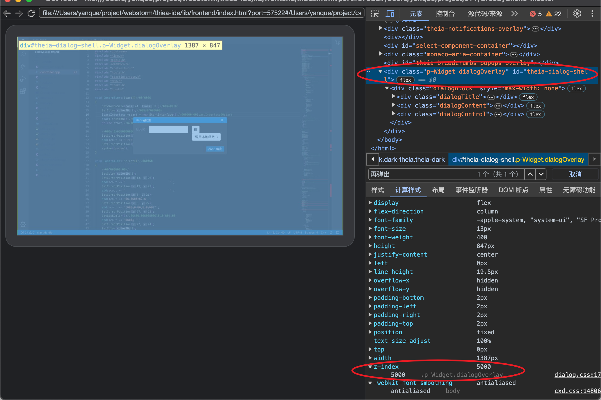

=================================================
在theia的react-dialog上新增自定义dialog
=================================================

.. post:: 2024-03-08 23:31:08
  :tags: 框架, theia, 问题
  :category: 前端
  :author: YanQue
  :location: CD
  :language: zh-cn

使用开发者工具可以看出,
theia内置的react-dialog是先覆盖了一层 `z-index` 为 5000 的 `div`:

.. note::

  这里的 `react-dialog` 即::

    import {ReactDialog} from "@theia/core/lib/browser/dialogs/react-dialog";

如果要在其上再弹出一个dialog, 要么, 减小原有的这个 5000; 要么, 增大需要增加的 `z-index`

