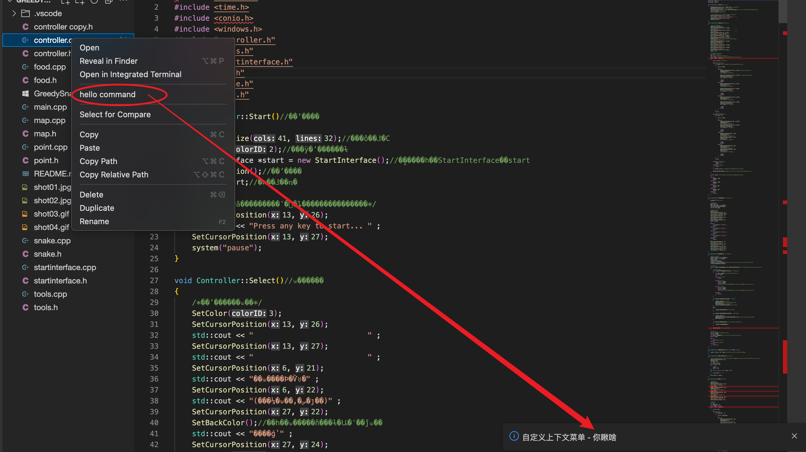

==========================================
自定义任意位置的鼠标右键上下文菜单
==========================================

说明: 即, 当鼠标右键单击时, 在单击的位置触发的菜单栏
(就像Win桌面鼠标右键触发的那玩意儿)

首先需要注册一个菜单指令(菜单的指令, 与实际的指令)::

  /* 先注册一个自定义的菜单 */

  namespace CustomContextMenuCommand {
      const category = 'custom-context-menu-command'

      export const HELLO_COMMAND = Command.toDefaultLocalizedCommand({
          id: 'custom:command',
          category: category,
          label: 'hello command'
      })
  }

将菜单与指令注册到贡献点::

  @injectable()
  export class CustomAContextMenu implements CommandContribution, MenuContribution{

      constructor(
          @inject(MessageService) private readonly _messageService: MessageService,

      ) {
      }

      registerCommands(commands: CommandRegistry) {
          commands.registerCommand(
              CustomContextMenuCommand.HELLO_COMMAND,
              {execute: async (...args) => {
                  await this._messageService.info('自定义上下文菜单 - 你瞅啥')
                  }}
          )
      }

      registerMenus(menus: MenuModelRegistry) {
          menus.registerMenuAction(
              [...NAVIGATOR_CONTEXT_MENU, '_1_hello'],
              // CommonMenus.EDIT_CONTEXT_MENU,
              {
                  commandId: CustomContextMenuCommand.HELLO_COMMAND.id,
                  label: CustomContextMenuCommand.HELLO_COMMAND.label,
              }
          )

      }

  }

这里是注册到系统左侧的导航栏位置的文件资源管理器, 预定义的菜单名为 `NAVIGATOR_CONTEXT_MENU`,
要在这里触发, 直接放这里即可

效果:

如何手动使用代码触发?
==========================================

注入render::

  // import {ContextMenuRenderer} from "@theia/core/lib/browser";

  @inject(ContextMenuRenderer) readonly _contextMenuRender: ContextMenuRenderer,

调用打开::

  openMenu(e) {

    this._contextMenuRender.render({
        menuPath: NAVIGATOR_CONTEXT_MENU,
        anchor: {x: e.clienX, y: e.clientY},    // 坐标位置
        args: [],               // 参数
    })
  }

这里的调用可以放到诸如div的右键事件去, 比如::

  

  

