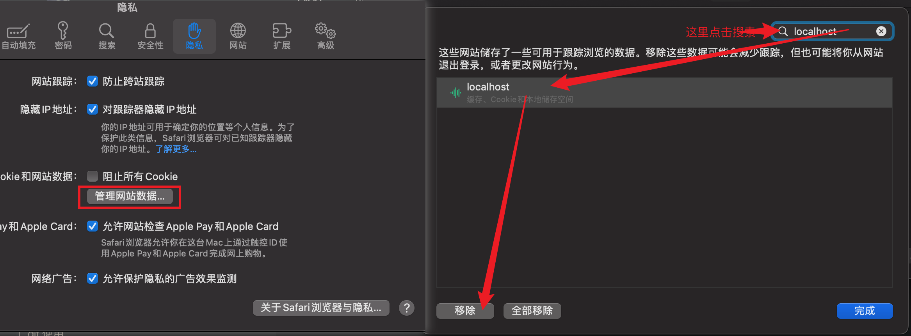

====================
浏览器缓存清理
====================

.. post:: 2023-02-26 21:30:12
  :tags: 问题
  :category: 前端
  :author: YanQue
  :location: CD
  :language: zh-cn

safari清理缓存
====================

``Command + ,`` 打开设置::

  隐私 -> 管理网站数据 -> `选中需要移除的网站(可搜索)` -> 移除

  safari 清理某网站缓存

