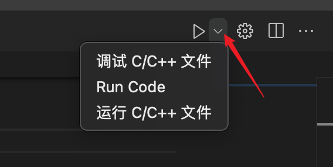
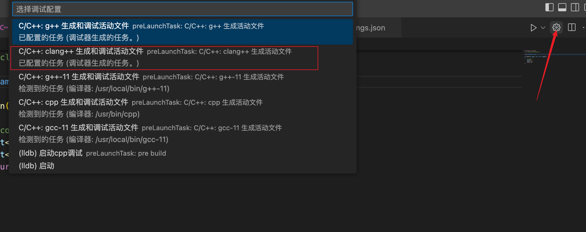

===========================
vscode调试相关
===========================

.. post:: 2023-02-20 22:06:49
  :tags: c
  :category: 后端
  :author: YanQue
  :location: CD
  :language: zh-cn

调试命令工具
===========================

- gdb
- lldb

.. note::

	lldb 是mac上才有的, xcode低版本使用的是gdb调试, 高版本换成了内置lldb

	另外, gcc 与 g++ 是编译为可执行文件的, gdb与lldb才是调试工具.

:指令区别: `lldb与gdb命令名的对照表 <http://lldb.llvm.org/lldb-gdb.html>`_

配置经验
===========================

#. 创建launch.json调试器, 支持直接调试与附加调试(这个配置是给左侧的调试器使用的)

例::

	{
		"version": "0.2.0",
		"configurations": [
			{
				"name": "(lldb) 启动",
				"type": "cppdbg",
				"request": "launch",
				"program": "${fileDirname}/.debug/${fileBasenameNoExtension}.out",
				"args": [],
				"stopAtEntry": false,
				"cwd": "${fileDirname}",
				"environment": [],
				"externalConsole": false,
				"MIMode": "lldb",
				"preLaunchTask": "pre build"
			}
		]
	}

#. 类似c/c++程序, 调试之前需要先编译为可执行文件, 这个时候就需要用到task.json配置任务, 此处的 `label` 与 launch.json 的 `preLaunchTask` 保持一致

例::

	{
		"tasks": [
			{
				"label": "pre build",
				"type": "cppbuild",
				"command": "/usr/bin/g++",
				"args": [
					"-fdiagnostics-color=always",
					"-g",
					"${file}",
					"-o",
					"${fileDirname}/.debug/${fileBasenameNoExtension}.out"
				],
				"options": {
					"cwd": "${fileDirname}"
				},
				"problemMatcher": [
					"$gcc"
				],
				"group": {
					"kind": "build",
					"isDefault": true
				},
				"detail": "调试器生成的任务。"
			}
		],
		"version": "2.0.0"
	}

.. note::

	gcc指定输出位置的时候, 有bug..., 会导致卡住.

	另外右上角的启动调试与左边的不是一个东西. F5启动的也是左边配置的.

	也就是, F5启动的是json配置的调试, 直接右上角run是内置的直接执行编译运行指令(不过编译那一步会写到task.json种).

配置文件说明
===========================

- launch.json 这个可以不用设置, 直接使用task.json里任务生成输出文件
- task.json 用来配置任务, 可在launch.json里配置什么时候掉用
- c_cpp_properties.json 用于给插件配置, 比如使用的 include_path, 注意这里只是给插件使用的, 如果需要执行或者编译的时候使用需要自定义编译时候的参数, 如 g++ -L 指定库路径

.. note::

	注意 c_cpp_properties 配置的 include_path 不能用于执行时使用.

	执行时候只能自定义参数, 可以通过在 setting.json 配置 `code-runner.executorMap` 处理.

其他
===========================

可以选择小三角形的启动方式

	启动选项

可以通过设置选择启动选项相对应的任务

	选择启动选项实际的执行
