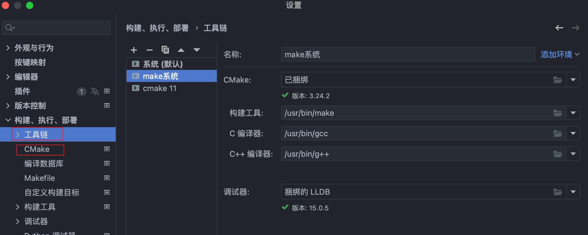

=============================
使用CLion遇到的坑
=============================

c(++)的项目根据不同的编译方式, 可以分为几类项目:

- cmake
- makefile
- compilation database
- gradle

:官网指引::
  https://www.jetbrains.com/help/clion/clion-quick-start-guide.html#open-create-prj
  https://www.jetbrains.com/zh-cn/clion/features/start-your-project.html

暂且只说cmake项目

配置
=============================

对于CLion而言, 需要配置的主要有以下几个地方:

- 工具链
  在此处指定make, gcc, g++ 的路径
- cmake
  指定本cmake项目使用哪一个配置的工具链
- CMakeLists.txt
  CMakeLists.txt位于项目根目录下, 里面写明了如何构建环境. 比如环境变量, 如何运行都依赖此文件.

  工具链和cmake

.. note::

  若无cmake需要自行下载安装, 正常直接执行::

    xcode-select --install

  安装好绑定的工具即可(不过我用的时候, 这样生成的默认构建工具ninja使用的时候有些问题).

  若需要自行安装cmake官网版本, 可参考 :doc:`/docs/后端/c/cmake`

打开项目
=============================

对于cmake项目而言, 打开项目时, 项目根目录下一定要有 CMakeLists.txt 文件.

CLion会根据, 且只会根据此文件去编译项目, 类似在项目根目录下执行以下指令::

  mkdir cmake-build-debug && cd cmake-build-debug && cmake ../

然后会生成一个可执行的配置(就是右上角那个绿色三角形了)

找不到项目头文件
=============================

打开 CMakeLists.txt , 在其中加入头文件搜索路径, 多个路径直接换行即可::

  include_directories(
    path1
    path2
    ...
  )

将CLion项目转换为VS工程
=============================

根目录下执行::

  mkdir build
  cd build
  cmake -G "Visual Studio 16 2019" -A x64 ..

:参考:: https://www.coder.work/article/7296599

:cmake详解:: https://www.cnblogs.com/kuliuheng/p/9431275.html

.. note::

  cmake 与 make 相比能够更好的实现跨平台的兼容.

  cmake: 根据 CMakeLists.txt 生成适配不同平台的 makefile, 再根据此makefile去执行编译
  makefile: 直接根据makefile内容编译生成
