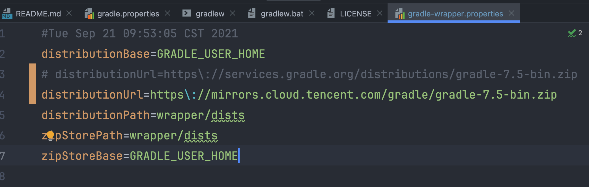
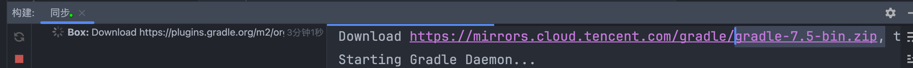

.. toctree::
  :maxdepth: 1

.. post:: 2024-03-09 18:21:01
  :tags: java, 构建工具, gradle
  :category: 后端
  :author: YanQue
  :location: CD
  :language: zh-cn

  配置文件说明
  相关环境变量说明

Gradle项目初始化下载慢
==================================

Android-Gradle项目初始化构建时, 下载 ``gradle-7.5-bin.zip`` 慢的问题

修改 ``gradle-wrapper.properties`` 文件,
我的在 ``gradle/wrapper/gradle-wrapper.properties``,
找不到就全局搜一下,
将原本的::

  distributionUrl=https\://services.gradle.org/distributions/gradle-7.5-bin.zip

更改为镜像代理地址路径(这里用的腾讯的)::

  distributionUrl=https\://mirrors.cloud.tencent.com/gradle/gradle-7.5-bin.zip

具体位置可以进去腾讯代理地址自己找找: `https://mirrors.cloud.tencent.com/`

修改后

