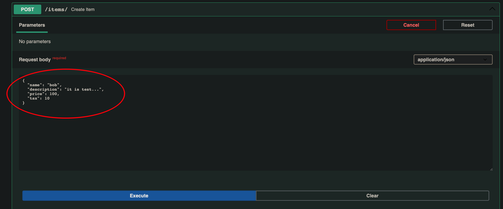
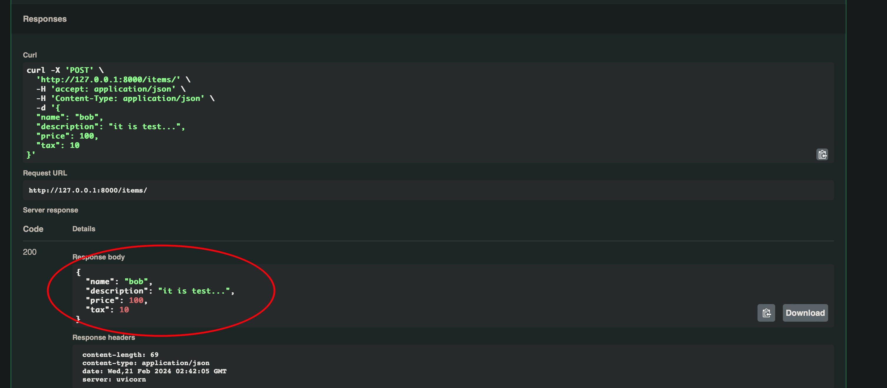

=================================
请求和响应
=================================

参考: `FastAPI 请求和响应 <https://www.runoob.com/fastapi/fastapi-request-response.html>`_

在 FastAPI 中，请求（Request）和响应（Response）是与客户端交互的核心。
FastAPI 提供了强大的工具来解析请求数据，并根据需要生成规范的响应。
接下来我们来详细看下 FastAPI 的请求和响应。
HTTP 相关内容可以参考: `HTTP 请求方法 <https://www.runoob.com/http/http-tutorial.html>`_

请求数据
=================================

查询参数
---------------------------------

以下实例中我们定义了一个 /items/ 路由，接受两个查询参数 skip 和 limit，它们的类型均为整数，默认值分别为 0 和 10::

  from fastapi import FastAPI

  app = FastAPI()

  @app.get("/items/")
  def read_item(skip: int = 0, limit: int = 10):
      return {"skip": skip, "limit": limit}

在命令行中运行以下命令以启动应用::

  uvicorn main:app --reload

现在，打开浏览器并访问 ``http://127.0.0.1:8000/items/``，返回了默认的 JSON 数据::

  {"skip": 0, "limit": 10}

路径参数
---------------------------------

我们可以把参数设置在路径上，这样 URL 看起来更美观一些。
以下实例我们定义了一个带有路径参数 item_id 和查询参数 q 的路由::

  from fastapi import FastAPI

  app = FastAPI()

  @app.get("/items/{item_id}")
  def read_item(item_id: int, q: str = None):
      return {"item_id": item_id, "q": q}

传递 GET 请求的参数 ``http://127.0.0.1:8000/items/5/?q=runoob``，
返回 JSON 数据如下所示::

  {"item_id": 5, "q": "runoob"}

请求体
---------------------------------

接下来我们创建了一个 /items/ 路由，
使用 @app.post 装饰器表示这是一个处理 POST 请求的路由::

  from pydantic import BaseModel
  from fastapi import FastAPI

  app = FastAPI()
  class Item(BaseModel):
      name: str
      description: str = None
      price: float
      tax: float = None

  @app.post("/items/")
  def create_item(item: Item):
      return item

使用 Pydantic 模型 Item 定义了一个请求体，包含多个字段，
其中一些有默认值，更多 Pydantic 介绍参考:
`FastAPI Pydantic 模型 <https://www.runoob.com/fastapi/fastapi-pydantic.html>`_

接下来我们可以打开 http://127.0.0.1:8000/docs 来进行 POST 测试：
填写请求参数：

返回结果:

响应数据
=================================

返回 JSON 数据
---------------------------------

路由处理函数返回一个字典，该字典将被 FastAPI 自动转换为 JSON 格式，并作为响应发送给客户端::

  from fastapi import FastAPI

  app = FastAPI()

  @app.get("/items/")
  def read_item(skip: int = 0, limit: int = 10):
      return {"skip": skip, "limit": limit}

以上代码在浏览器访问 http://127.0.0.1:8000/items/，返回了 JSON 数据::

  {"skip": 0, "limit": 10}

返回 Pydantic 模型
---------------------------------

路由处理函数返回一个 Pydantic 模型实例，FastAPI 将 **自动将其转换为 JSON 格式** ，并作为响应发送给客户端::

  from pydantic import BaseModel
  from fastapi import FastAPI

  app = FastAPI()
  class Item(BaseModel):
      name: str
      description: str = None
      price: float
      tax: float = None

  @app.post("/items/")
  def create_item(item: Item):
      return item

POST 请求，返回的数据格式如下所示::

  {
    "name": "runoob",
    "description": "菜鸟教程 POST 测试",
    "price": 12,
    "tax": 1
  }

.. _FastAPI-自定义请求头:

请求头和 Cookie
=================================

使用 **Header** 和 **Cookie** 类型注解获取请求头和 Cookie 数据::

  from fastapi import Header, Cookie
  from fastapi import FastAPI

  app = FastAPI()

  @app.get("/items/")
  def read_item(user_agent: str = Header(None), session_token: str = Cookie(None)):
      return {"User-Agent": user_agent, "Session-Token": session_token}

以上代码在浏览器访问 http://127.0.0.1:8000/items/，返回了 JSON 数据::

  {"User-Agent":"Mozilla/5.0 (Macintosh; Intel Mac OS X 10_15_7) AppleWebKit/605.1.15 (KHTML, like Gecko) Version/17.3.1 Safari/605.1.15","Session-Token":null}

.. _FastAPI-重定向和状态码:

重定向和状态码
=================================

使用 RedirectResponse 实现重定向，将客户端重定向到 /items/ 路由::

  from fastapi import Header, Cookie
  from fastapi import FastAPI
  from fastapi.responses import RedirectResponse

  app = FastAPI()

  @app.get("/items/")
  def read_item(user_agent: str = Header(None), session_token: str = Cookie(None)):
      return {"User-Agent": user_agent, "Session-Token": session_token}

  @app.get("/redirect")
  def redirect():
      return RedirectResponse(url="/items/")

使用 HTTPException 抛出异常，返回自定义的状态码和详细信息。
以下实例在 item_id 为 42 会返回 404 状态码::

  from fastapi import HTTPException

  @app.get("/items/{item_id}")
  def read_item(item_id: int):
      if item_id == 42:
          raise HTTPException(status_code=404, detail="Item not found")
      return {"item_id": item_id}

.. _FastAPI-自定义响应头:

自定义响应头
=================================

使用 JSONResponse 自定义响应头::

  from fastapi import FastAPI
  from fastapi.responses import JSONResponse

  app = FastAPI()

  @app.get("/items/{item_id}")
  def read_item(item_id: int):
      content = {"item_id": item_id}
      headers = {"X-Custom-Header": "custom-header-value"}
      return JSONResponse(content=content, headers=headers)

