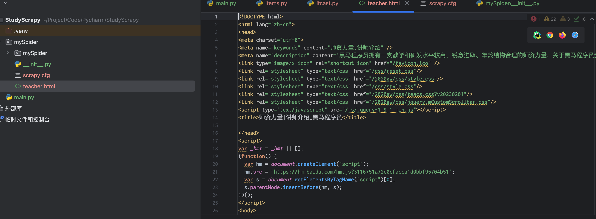
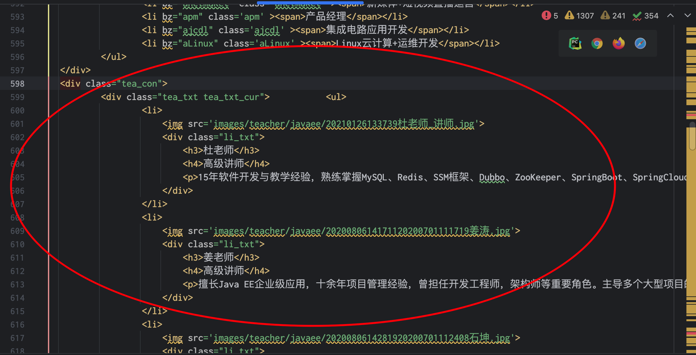
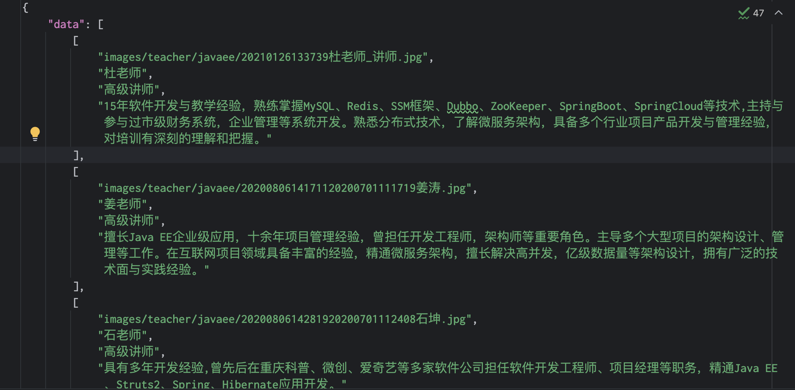
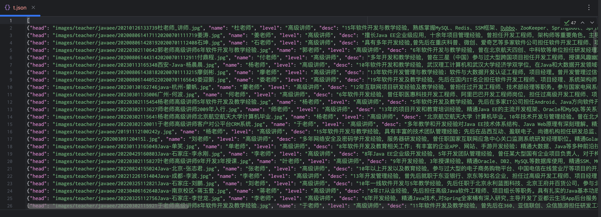

==================================
使用
==================================

制作 Scrapy 爬虫 一共需要4步：
  - 新建项目 (scrapy startproject xxx)：新建一个新的爬虫项目
  - 明确目标 （编写items.py）：明确你想要抓取的目标
  - 制作爬虫 （spiders/xxspider.py）：制作爬虫开始爬取网页
  - 存储内容 （pipelines.py）：设计管道存储爬取内容

新建项目
==================================

创建一个工作目录workdir并进入::

  mkdir workdir; cd workdir

创建虚拟环境(省略)并安装依赖::

  pip install Scrapy

创建项目::

  scrapy startproject mySpider

输出::

  (.venv) yanque@mbp16 StudyScrapy % scrapy startproject mySpider
  New Scrapy project 'mySpider', using template directory '/Users/yanque/Project/Code/Pycharm/StudyScrapy/.venv/lib/python3.11/site-packages/scrapy/templates/project', created in:
      /Users/yanque/Project/Code/Pycharm/StudyScrapy/mySpider          scons                  sconsign               screen                 script                 scutil

  You can start your first spider with:
      cd mySpider
      scrapy genspider example example.com

查看目录结构::

  (.venv) yanque@mbp16 StudyScrapy % tree mySpider
  mySpider
  ├── mySpider
  │   ├── __init__.py
  │   ├── items.py
  │   ├── middlewares.py
  │   ├── pipelines.py
  │   ├── settings.py
  │   └── spiders
  │       └── __init__.py
  └── scrapy.cfg

  2 directories, 7 files

这些文件分别是:

- scrapy.cfg: 项目的配置文件。
- mySpider/: 项目的Python模块，将会从这里引用代码。
- mySpider/items.py: 项目的目标文件。
- middlewares.py: 中间件文件
- mySpider/pipelines.py: 项目的管道文件。
- mySpider/settings.py: 项目的设置文件。
- mySpider/spiders/: 存储爬虫代码目录。

明确目标(mySpider/items.py)
==================================

我们打算抓取 `黑马 <http://www.itcast.cn/channel/teacher.shtml>`_ 网站里的所有讲师的姓名、职称和个人信息。

打开 mySpider 目录下的 items.py。

Item 定义结构化数据字段，用来保存爬取到的数据，有点像 Python 中的 dict，但是提供了一些额外的保护减少错误。

可以通过创建一个 scrapy.Item 类， 并且定义类型为 scrapy.Field 的类属性来定义一个 Item（可以理解成类似于 ORM 的映射关系）。

接下来，创建一个 ItcastItem 类，和构建 item 模型（model）::

  import scrapy

  class ItcastItem(scrapy.Item):
    head = scrapy.Field()
    name = scrapy.Field()
    level = scrapy.Field()
    desc = scrapy.Field()

制作爬虫(spiders/itcastSpider.py)
==================================

爬数据
----------------------------------

在 mySpider/spiders 目录下输入命令::

  scrapy genspider itcast "itcast.cn"

将在 mySpider/spiders 目录下创建一个名为 `itcast` 的爬虫，并指定爬取域的范围.
mySpider/spiders 目录里的 itcast.py，默认代码::

  import scrapy

  class ItcastSpider(scrapy.Spider):
      name = "itcast"
      allowed_domains = ["itcast.cn"]
      start_urls = (
          'http://www.itcast.cn/',
      )

      def parse(self, response):
          pass

.. note::

  可以由我们自行创建itcast.py并编写上面的代码，只不过使用命令可以免去编写固定代码的麻烦

要建立一个Spider， 你必须用scrapy.Spider类创建一个子类，并确定了三个强制的属性 和 一个方法。

name = ""
  这个爬虫的识别名称，必须是唯一的，在不同的爬虫必须定义不同的名字。
allow_domains = []
  是搜索的域名范围，也就是爬虫的约束区域，规定爬虫只爬取这个域名下的网页，不存在的URL会被忽略。

  **新版本貌似已经废弃**

.. _start_requests:

start_urls = ()
  爬取的URL元祖/列表。爬虫从这里开始抓取数据，所以，第一次下载的数据将会从这些urls开始。其他子URL将会从这些起始URL中继承性生成。

  或者不定义 start_urls, 直接重写 start_requests ::

    def start_requests(self):
          urls = [
              "https://quotes.toscrape.com/page/1/",
              "https://quotes.toscrape.com/page/2/",
          ]
          for url in urls:
              yield scrapy.Request(url=url, callback=self.parse)

  注意 start_requests 返回结果需要是一个生成器

.. _parse:

parse(self, response)
  解析的方法，每个初始URL完成下载后将被调用，调用的时候传入从每一个URL传回的Response对象来作为唯一参数，
  主要作用如下：

  - 负责解析返回的网页数据(response.body)，提取结构化数据(生成item)
  - 生成需要下一页的URL请求。

将start_urls的值修改为需要爬取的第一个url::

  start_urls = ("http://www.itcast.cn/channel/teacher.shtml",)

修改parse()方法::

  from scrapy.http import Request, Response

  def parse(self, response: Response):
    filename = "teacher.html"
    with open(filename, 'w') as f:
        f.write(response.body.decode('utf-8'))

然后运行一下这个爬虫看看，在 mySpider 目录下执行( **一定要确定正确的根目录** )::

  cd mySpider; scrapy crawl itcast

可以看到 mySpider 下生成了爬取的 teacher.html

.. sidebar:: 发生了什么?

  不管是否重新定义 start_requests_ ,
  start_requests 的返回结果都是 `scrapy.Request` 对象的生成器

  对于每一个生成器的 url, 都会调用 parse_ 方法, 处理拿到的数据

  另外, start_requests_ 返回的 `scrapy.Request` 默认回调就是 parse_

shell工具
----------------------------------

最开始可以使用 :doc:`/docs/后端/python/python三方库/Scrapy/Scrapy shell` 工具::

  scrapy shell 'http://www.itcast.cn/channel/teacher.shtml'

来启动一个交互式终端

可以选择使用了指定 CSS 标签, 示例寻找 ``<title>`` 元素::

  >>> response.css("title")
  [<Selector query='descendant-or-self::title' data='<title>师资力量|讲师介绍_黑马程序员</title>'>]
  >>>

输出结果是一个 `SelectorList` 对象, 代表所有查询到的元素的列表

查看所有::

  >>> response.css("title").getall()
  ['<title>师资力量|讲师介绍_黑马程序员</title>']

只需要文本::

  >>> response.css("title::text").getall()
  ['师资力量|讲师介绍_黑马程序员']

只获取第一个元素的文本::

  >>> response.css("title::text").get()
  '师资力量|讲师介绍_黑马程序员'

等价于::

  >>> response.css("title::text")[0].get()
  '师资力量|讲师介绍_黑马程序员'

.. note::

  使用索引的方式, 如果没有就报错索引越界, 所以还是直接用 get 获取第一个好点

还支持使用 re 进行正则::

  >>> response.css("title::text").re(r".*")
  ['师资力量|讲师介绍_黑马程序员', '']
  >>>
  >>> response.css("title::text").re(r"\w*")
  ['师资力量', '', '讲师介绍_黑马程序员', '']
  >>>
  >>> response.css("title::text").re(r"(\w*)_(\w*)")
  ['讲师介绍', '黑马程序员']

还可以从浏览器打开缓存的 HTML 页面::

  >>> view(response)
  True

原始数据解析
----------------------------------

我们可以研究下之前拿到的 `teacher.html`,
可以看到, 老师信息都在一个 div 里面:

结构大概如下::

  

    
 第一部分老师信息的 li 列表 

    
 第二部分老师信息的 li 列表 

    
 第三部分老师信息的 li 列表 

    ...
  

我们现在使用 CSS 选择器获取最外层::

  >>> response.css("div.tea_con")
  [<Selector query="descendant-or-self::div[@class and contains(concat(' ', normalize-space(@class), ' '), ' tea_con ')]" data='
\n\t\t
]
  >>>

定位下一层(输出太多就不全贴)::

  >>> response.css("div.tea_con div.tea_txt")
  [<Selector query="descendant-or-self::div[@class and contains(concat(' ', normalize-space(@class), ' '), ' tea_con ')]...

这个时候获取的结果列表是所有的::

  
...
  
...
  
...
  ...

继续, 如何获取每一部分的信息, 先观察html::

  <ul>
				<li>
					
					

						<h3>杜老师</h3>
						<h4>高级讲师</h4>
						
15年软件开发与教学经验，熟练掌握MySQL、Redis、SSM框架、Dubbo、ZooKeeper、SpringBoot、SpringCloud等技术,主持与参与过市级财务系统，企业管理等系统开发。熟悉分布式技术，了解微服务架构，具备多个行业项目产品开发与管理经验，对培训有深刻的理解和把握。

					

				</li>
				<li>
					
					

						<h3>姜老师</h3>
						<h4>高级讲师</h4>
						
擅长Java EE企业级应用，十余年项目管理经验，曾担任开发工程师，架构师等重要角色。主导多个大型项目的架构设计、管理等工作。在互联网项目领域具备丰富的经验，精通微服务架构，擅长解决高并发，亿级数据量等架构设计，拥有广泛的技术面与实践经验。

					

				</li>

        ...
  </ul>

到这里其实就不用考虑外部的循环了, 可以直接定位到每一个li标签::

  response.css("div.tea_con div.tea_txt ul li")

先只考虑第一个(因为li内部结构一致, 后面的迭代就行)::

  >>> response.css("div.tea_con div.tea_txt ul li")[0]
  <Selector query="descendant-or-self::div[@class and contains(concat(' ', normalize-space(@class), ' '), ' tea_con ')]/descendant-or-self::*/div[@class and contains(concat(' ', normalize-space(@class), ' '), ' tea_txt ')]/descendant-or-self::*/ul/descendant-or-self::*/li" data='<li>\n\t\t\t\t\t
  >>>
  >>> t1 = response.css("div.tea_con div.tea_txt ul li")[0]
  >>>

获取老师照片::

  >>> t1.css("img::attr(src)").get()
  'images/teacher/javaee/20210126133739杜老师_讲师.jpg'

获取老师名字::

  >>> t1.css("h3::text").get()
  '杜老师'

级别::

  >>> t1.css("h4::text").get()
  '高级讲师'

介绍::

  >>> t1.css("p::text").get()
  '15年软件开发与教学经验，熟练掌握MySQL、Redis、SSM框架、Dubbo、ZooKeeper、SpringBoot、SpringCloud等技术,主持与参与过市级财务系统，企业管理等系统开发。熟悉分布式技术，了解微服务架构，具备多个行业项目产品开发与管理经验，对培训有深刻的理解和把握。'
  >>>

那么对于所有的老师, 可以简单的循环处理::

  >>> data = []
  >>> from collections import namedtuple
  >>> Teacher = namedtuple("Teacher", ["image", "name", "level", "desc"])
  >>> for t in response.css("div.tea_con div.tea_txt ul li"):
  ...     img = t.css("img::attr(src)").get()
  ...     name = t.css("h3::text").get()
  ...     level = t.css("h4::text").get()
  ...     desc = t.css("p::text").get()
  ...     data.append(Teacher(img, name, level, desc))

就获取到了所有数据, 可以简单看看结果::

  >>> data[0]
  Teacher(image='images/teacher/javaee/20210126133739杜老师_讲师.jpg', name='杜老师', level='高级讲师', desc='15年软件开发与教学经验，熟练掌握MySQL、Redis、SSM框架、Dubbo、ZooKeeper、SpringBoot、SpringCloud等技务架构，具备多个行业项目产品开发与管理经验，对培训有深刻的理解和把握。')
  >>> data[1]
  Teacher(image='images/teacher/javaee/2020080614171120200701111719姜涛.jpg', name='姜老师', level='高级讲师', desc='擅长Java EE企业级应用，十余年项目管理经验，曾担任开发工程师，架构师等重要角色。主导多个大型项构设计，拥有广泛的技术面与实践经验。')
  >>> data.__len__()
  179

所以 parse 可以这么写::

  def parse(self, response: Response):
    # filename = "teacher.html"
    # with open(filename, 'w') as f:
    #     f.write(response.body.decode('utf-8'))

    from collections import namedtuple
    Teacher = namedtuple("Teacher", ["image", "name", "level", "desc"])
    data: [Teacher] = []
    for t in response.css("div.tea_con div.tea_txt ul li"):
        img = t.css("img::attr(src)").get()
        name = t.css("h3::text").get()
        level = t.css("h4::text").get()
        desc = t.css("p::text").get()
        data.append(Teacher(img, name, level, desc))

    with open("teacher.json", "w") as f:
        json.dump({"data": data}, f, ensure_ascii=False, indent=4)

执行下看看结果::

  cd mySpider; scrapy crawl itcast

teacher.json内容(部分):

解析数据转给框架
----------------------------------

还是改 parse::

  def parse(self, response: Response):
    for t in response.css("div.tea_con div.tea_txt ul li"):
        img = t.css("img::attr(src)").get()
        name = t.css("h3::text").get()
        level = t.css("h4::text").get()
        desc = t.css("p::text").get()

        yield {
            "head": img,
            "name": name,
            "level": level,
            "desc": desc,
        }

这个时候再启动就可以看到数据打印在日志了, 太多我就不放了.

将框架获取到的数据导出到 t.json::

  scrapy crawl itcast -O t.json

效果:

还可使用 `-o t.jsonl` 仅新增, 详细参考 :ref:`crawl <CmdCrawl>`

如果需要或许的数据是链接比如 href (即动态的)::

  <ul class="pager">
      <li class="next">
          <a href="/page/2/">Next &rarr;</a>
      </li>
  </ul>

可以在parse后增加后续的爬取::

  def parse(...):
    ...

    next_page = response.css("li.next a::attr(href)").get()
    if next_page is not None:
        next_page = response.urljoin(next_page)
        yield scrapy.Request(next_page, callback=self.parse)

.. note::

  urljoin 提供了自动拼接到上一层, 从而转换为绝对路径的功能

  或者也可以直接通过 ``response.follow`` 使用相对路径::

    for href in response.css("ul.pager a::attr(href)"):
      yield response.follow(href, callback=self.parse)

  实际对于 a 标签, 提供了自动支持找href的功能::

    for a in response.css("ul.pager a"):
      yield response.follow(a, callback=self.parse)

  甚至可以直接一次性多匹配::

    anchors = response.css("ul.pager a")
      yield from response.follow_all(anchors, callback=self.parse)

    # 简单点就是
    yield from response.follow_all(css="ul.pager a", callback=self.parse)

XPath支持
----------------------------------

XPath 参考 :doc:`/docs/后端/python/教程/xpath/index`

除了 上面的使用 CSS选择器来做数据提取,
Scrapy的 选择器 也支持 `XPath` 对象::

  >>> response.xpath("//title")
  [<Selector query='//title' data='<title>师资力量|讲师介绍_黑马程序员</title>'>]

返回的也是 :doc:`API/SelectorList` 对象::

  >>> response.xpath("//title").get()
  '<title>师资力量|讲师介绍_黑马程序员</title>'

.. note::

  举例, 如果有一个 div::

    

  如何正确的选择此节点::

    response.css("div.quote")

举例, 还是上面的老师信息获取::

  >>> response.xpath("//div[@class='tea_con']")
  [<Selector query="//div[@class='tea_con']" data='
\n\t\t
]

同样的, parse 文件

存储内容 （pipelines.py）
==================================

设计管道存储爬取内容

如果只是简单的获取某些数据, 那么上面的内容已经足够.

但若想处理更复杂的事情, 那么就需要使用到 pipelines

参考: `Scrapy Tutorial <https://docs.scrapy.org/en/latest/intro/tutorial.html>`_

