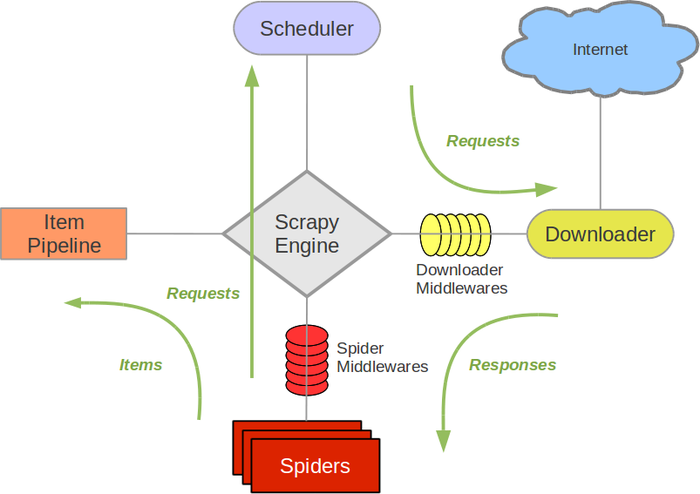

===============================
架构
===============================

架构图(绿色线代表数据流)

  架构

Scrapy Engine(引擎)
  负责Spider、ItemPipeline、Downloader、Scheduler中间的通讯，信号、数据传递等。
Scheduler(调度器)
  它负责接受引擎发送过来的Request请求，并按照一定的方式进行整理排列，入队，当引擎需要时，交还给引擎。
Downloader（下载器）
  负责下载Scrapy Engine(引擎)发送的所有Requests请求，并将其获取到的Responses交还给Scrapy Engine(引擎)，由引擎交给Spider来处理，
Spider（爬虫）
  它负责处理所有Responses,从中分析提取数据，获取Item字段需要的数据，并将需要跟进的URL提交给引擎，再次进入Scheduler(调度器).
Item Pipeline(管道)
  它负责处理Spider中获取到的Item，并进行进行后期处理（详细分析、过滤、存储等）的地方。
Downloader Middlewares（下载中间件）
  你可以当作是一个可以自定义扩展下载功能的组件。
Spider Middlewares（Spider中间件）
  你可以理解为是一个可以自定扩展和操作引擎和Spider中间通信的功能组件（比如进入Spider的Responses;和从Spider出去的Requests）

