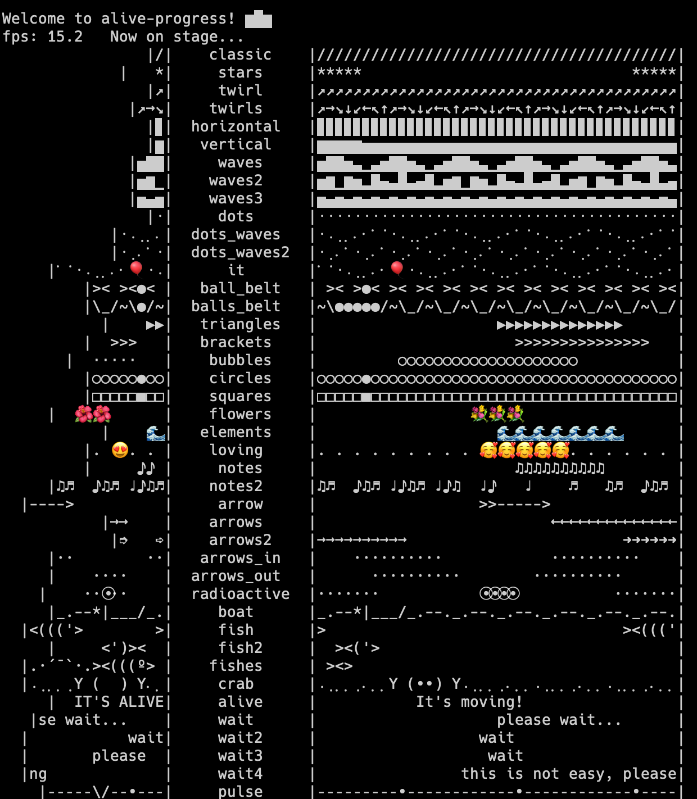

===========================
alive-progress
===========================

关于进度条可参见: :ref:`ProgressInPy`

安装::

  pip install alive-progress

与 :doc:`/docs/后端/python/python三方库/progress` 类似,
不过更花哨::

  from alive_progress.styles import showtime

  def print_hi():
      showtime()

