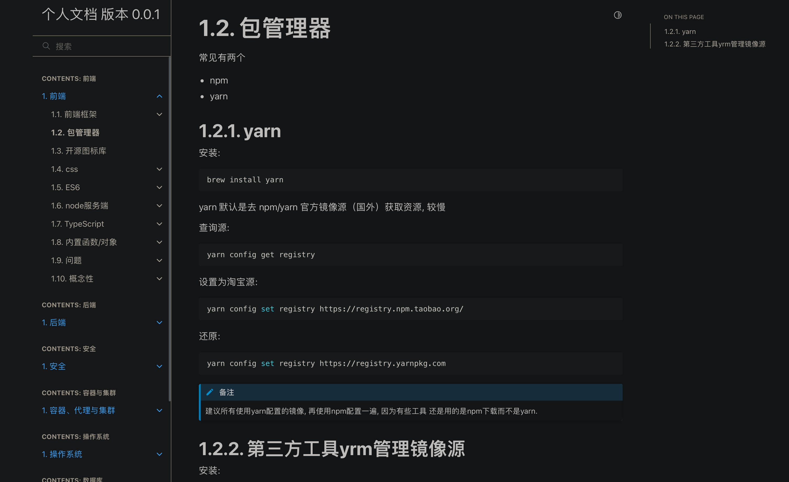

=============================================
furo
=============================================

.. post:: 2024-03-13 20:29:00
  :tags: python, python三方库
  :category: 后端
  :author: YanQue
  :location: CD
  :language: zh-cn

一个开源的sphinx主题.

默认的效果大概这样

安装::

  pip install furo

- github地址: `<https://github.com/pradyunsg/furo?tab=readme-ov-file>`_
- 文档: `<https://pradyunsg.me/furo/quickstart/>`_

