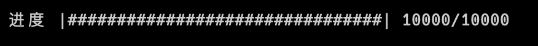

===========================
progress
===========================

安装::

  pip install progress

关于进度条可参见: :ref:`ProgressInPy`

主要是用来 ``progress.bar`` 做进度条控制的::

  from progress.bar import Bar

  def print_hi():
      n = 10000
      with Bar('进度', max=n) as bar:
          for i in range(n):
              for j in range(n):
                  j += i
              bar.next()

效果

