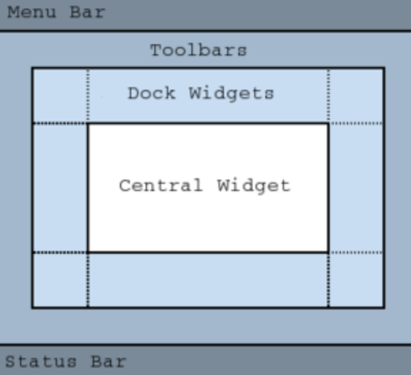

=====================
数据可视化工具
=====================

从CSV获取数据
=====================

读取CSV数据的几种方式:

- 直接读取
- 使用 csv 库: :doc:`/docs/后端/python/python标准库/csv`
- numpy: :doc:`/docs/后端/python/python三方库/numpy`
- pandas: :doc:`/docs/后端/python/python三方库/pandas`

以使用 pandas 为例::

  import argparse
  import pandas as pd

  def read_data(fname):
      return pd.read_csv(fname)

  if __name__ == "__main__":
      options = argparse.ArgumentParser()
      options.add_argument("-f", "--file", type=str, required=True)
      args = options.parse_args()
      data = read_data(args.file)
      print(data)

数据过滤
=====================

- QDateTime 设置时间
- QTimeZone 设置时区

例::

    import argparse
    import pandas as pd

    from PySide6.QtCore import QDateTime, QTimeZone

    def transform_date(utc, timezone=None):
        utc_fmt = "yyyy-MM-ddTHH:mm:ss.zzzZ"
        new_date = QDateTime().fromString(utc, utc_fmt)
        if timezone:
            new_date.setTimeZone(timezone)
        return new_date

    def read_data(fname):
        # Read the CSV content
        df = pd.read_csv(fname)

        # Remove wrong magnitudes
        df = df.drop(df[df.mag < 0].index)
        magnitudes = df["mag"]

        # My local timezone
        timezone = QTimeZone(b"Europe/Berlin")

        # Get timestamp transformed to our timezone
        times = df["time"].apply(lambda x: transform_date(x, timezone))

        return times, magnitudes

    if __name__ == "__main__":
        options = argparse.ArgumentParser()
        options.add_argument("-f", "--file", type=str, required=True)
        args = options.parse_args()
        data = read_data(args.file)
        print(data)

使用 QMainWindow
=====================

QMainWindow 是一个预定义的 GUI 主界面框架/结构:

源码::

    from PySide6.QtCore import Slot
    from PySide6.QtGui import QAction, QKeySequence
    from PySide6.QtWidgets import QMainWindow

    class MainWindow(QMainWindow):
        def __init__(self):
            QMainWindow.__init__(self)
            self.setWindowTitle("Eartquakes information")

            # Menu
            self.menu = self.menuBar()
            self.file_menu = self.menu.addMenu("File")

            # Exit QAction
            exit_action = QAction("Exit", self)
            exit_action.setShortcut(QKeySequence.Quit)
            exit_action.triggered.connect(self.close)

            self.file_menu.addAction(exit_action)

            # Status Bar
            self.status = self.statusBar()
            self.status.showMessage("Data loaded and plotted")

            # Window dimensions
            geometry = self.screen().availableGeometry()
            self.setFixedSize(geometry.width() * 0.8, geometry.height() * 0.7)

增加 QTableView
=====================

QTableView 需要一个模型来显示数据. 可以使用 QAbstractTableModel 的实例.

.. note::

    也可以使用更便捷的控件 QTableWidget. 相对减少代码量(不用写数据模型), 但是也降低了大数据时的性能, 不够灵活.

对于 QAbstractTableModel:

- headerData, 实现此方法来定义表格标题
- rowCount, 表格行数
- columnCount, 表格列数

例, 自定义数据类 CustomTableModel ::

    from PySide6.QtCore import Qt, QAbstractTableModel, QModelIndex
    from PySide6.QtGui import QColor

    class CustomTableModel(QAbstractTableModel):
        def __init__(self, data=None):
            QAbstractTableModel.__init__(self)
            self.load_data(data)

        def load_data(self, data):
            self.input_dates = data[0].values
            self.input_magnitudes = data[1].values

            self.column_count = 2
            self.row_count = len(self.input_magnitudes)

        def rowCount(self, parent=QModelIndex()):
            return self.row_count

        def columnCount(self, parent=QModelIndex()):
            return self.column_count

        def headerData(self, section, orientation, role):
            if role != Qt.DisplayRole:
                return None
            if orientation == Qt.Horizontal:
                return ("Date", "Magnitude")[section]
            else:
                return f"{section}"

        def data(self, index, role=Qt.DisplayRole):
            column = index.column()
            row = index.row()

            if role == Qt.DisplayRole:
                if column == 0:
                    date = self.input_dates[row].toPython()
                    return str(date)[:-3]
                elif column == 1:
                    magnitude = self.input_magnitudes[row]
                    return f"{magnitude:.2f}"
            elif role == Qt.BackgroundRole:
                return QColor(Qt.white)
            elif role == Qt.TextAlignmentRole:
                return Qt.AlignRight

            return None

创建表格::

    from PySide6.QtWidgets import (QHBoxLayout, QHeaderView, QSizePolicy,
                                QTableView, QWidget)

    from table_model import CustomTableModel

    class Widget(QWidget):
        def __init__(self, data):
            QWidget.__init__(self)

            # Getting the Model
            self.model = CustomTableModel(data)

            # Creating a QTableView
            self.table_view = QTableView()
            self.table_view.setModel(self.model)

            # QTableView Headers
            self.horizontal_header = self.table_view.horizontalHeader()
            self.vertical_header = self.table_view.verticalHeader()
            self.horizontal_header.setSectionResizeMode(
                                QHeaderView.ResizeToContents
                                )
            self.vertical_header.setSectionResizeMode(
                                QHeaderView.ResizeToContents
                                )
            self.horizontal_header.setStretchLastSection(True)

            # QWidget Layout
            self.main_layout = QHBoxLayout()
            size = QSizePolicy(QSizePolicy.Preferred, QSizePolicy.Preferred)

            ## Left layout
            size.setHorizontalStretch(1)
            self.table_view.setSizePolicy(size)
            self.main_layout.addWidget(self.table_view)

            # Set the layout to the QWidget
            self.setLayout(self.main_layout)

增加图片视图 QtCharts
=========================

使用

- QtCharts
- QChartView

.. note::

    在 QChartView 内放置 QtCharts

设计一个空的 图表::

    from PySide6.QtCore import QDateTime, Qt
    from PySide6.QtGui import QPainter
    from PySide6.QtWidgets import (QWidget, QHeaderView, QHBoxLayout, QTableView,
                                QSizePolicy)
    from PySide6.QtCharts import QChart, QChartView, QLineSeries, QDateTimeAxis, QValueAxis

    from table_model import CustomTableModel

    class Widget(QWidget):
        def __init__(self, data):
            QWidget.__init__(self)

            # Getting the Model
            self.model = CustomTableModel(data)

            # Creating a QTableView
            self.table_view = QTableView()
            self.table_view.setModel(self.model)

            # QTableView Headers
            self.horizontal_header = self.table_view.horizontalHeader()
            self.vertical_header = self.table_view.verticalHeader()
            self.horizontal_header.setSectionResizeMode(QHeaderView.ResizeToContents)
            self.vertical_header.setSectionResizeMode(QHeaderView.ResizeToContents)
            self.horizontal_header.setStretchLastSection(True)

            # Creating QChart
            self.chart = QChart()
            self.chart.setAnimationOptions(QChart.AllAnimations)

            # Creating QChartView
            self.chart_view = QChartView(self.chart)
            self.chart_view.setRenderHint(QPainter.Antialiasing)

            # QWidget Layout
            self.main_layout = QHBoxLayout()
            size = QSizePolicy(QSizePolicy.Preferred, QSizePolicy.Preferred)

            ## Left layout
            size.setHorizontalStretch(1)
            self.table_view.setSizePolicy(size)
            self.main_layout.addWidget(self.table_view)

            ## Right Layout
            size.setHorizontalStretch(4)
            self.chart_view.setSizePolicy(size)
            self.main_layout.addWidget(self.chart_view)

            # Set the layout to the QWidget
            self.setLayout(self.main_layout)

绘制图表
=========================

在上一节使用 QtCharts 的基础上

根据CSV文件的数据来绘制图表

- QLineSeries, 折线图

例::

    from PySide6.QtCore import QDateTime, Qt
    from PySide6.QtGui import QPainter
    from PySide6.QtWidgets import (QWidget, QHeaderView, QHBoxLayout, QTableView,
                                QSizePolicy)
    from PySide6.QtCharts import QChart, QChartView, QLineSeries, QDateTimeAxis, QValueAxis

    from table_model import CustomTableModel

    class Widget(QWidget):
        def __init__(self, data):
            QWidget.__init__(self)

            # Getting the Model
            self.model = CustomTableModel(data)

            # Creating a QTableView
            self.table_view = QTableView()
            self.table_view.setModel(self.model)

            # QTableView Headers
            resize = QHeaderView.ResizeToContents
            self.horizontal_header = self.table_view.horizontalHeader()
            self.vertical_header = self.table_view.verticalHeader()
            self.horizontal_header.setSectionResizeMode(resize)
            self.vertical_header.setSectionResizeMode(resize)
            self.horizontal_header.setStretchLastSection(True)

            # Creating QChart
            self.chart = QChart()
            self.chart.setAnimationOptions(QChart.AllAnimations)
            self.add_series("Magnitude (Column 1)", [0, 1])

            # Creating QChartView
            self.chart_view = QChartView(self.chart)
            self.chart_view.setRenderHint(QPainter.Antialiasing)

            # QWidget Layout
            self.main_layout = QHBoxLayout()
            size = QSizePolicy(QSizePolicy.Preferred, QSizePolicy.Preferred)

            # Left layout
            size.setHorizontalStretch(1)
            self.table_view.setSizePolicy(size)
            self.main_layout.addWidget(self.table_view)

            # Right Layout
            size.setHorizontalStretch(4)
            self.chart_view.setSizePolicy(size)
            self.main_layout.addWidget(self.chart_view)

            # Set the layout to the QWidget
            self.setLayout(self.main_layout)

        def add_series(self, name, columns):
            # Create QLineSeries
            self.series = QLineSeries()
            self.series.setName(name)

            # Filling QLineSeries
            for i in range(self.model.rowCount()):
                # Getting the data
                t = self.model.index(i, 0).data()
                date_fmt = "yyyy-MM-dd HH:mm:ss.zzz"

                x = QDateTime().fromString(t, date_fmt).toSecsSinceEpoch()
                y = float(self.model.index(i, 1).data())

                if x > 0 and y > 0:
                    self.series.append(x, y)

            self.chart.addSeries(self.series)

            # Setting X-axis
            self.axis_x = QDateTimeAxis()
            self.axis_x.setTickCount(10)
            self.axis_x.setFormat("dd.MM (h:mm)")
            self.axis_x.setTitleText("Date")
            self.chart.addAxis(self.axis_x, Qt.AlignBottom)
            self.series.attachAxis(self.axis_x)
            # Setting Y-axis
            self.axis_y = QValueAxis()
            self.axis_y.setTickCount(10)
            self.axis_y.setLabelFormat("%.2f")
            self.axis_y.setTitleText("Magnitude")
            self.chart.addAxis(self.axis_y, Qt.AlignLeft)
            self.series.attachAxis(self.axis_y)

            # Getting the color from the QChart to use it on the QTableView
            color_name = self.series.pen().color().name()
            self.model.color = f"{color_name}"

