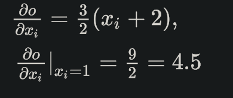
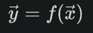
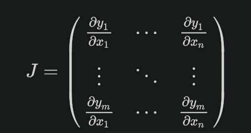

==============================
autograd-自动梯度
==============================

提供了对 Tensors 上所有运算操作的自动微分功能，也就是计算梯度的功能。
它属于 define-by-run 类型框架，即反向传播操作的定义是根据代码的运行方式，因此每次迭代都可以是不同的。

Tensor梯度计算
==============================

torch.Tensor 是 Pytorch 最主要的库，
当设置它的属性 .requires_grad=True，
那么就会开始追踪在该变量上的所有操作，而完成计算后，
可以调用 .backward() 并自动计算所有的梯度，得到的梯度都保存在属性 .grad 中。

调用 .detach() 方法分离出计算的历史，
可以停止一个 tensor 变量继续追踪其历史信息 ，同时也防止未来的计算会被追踪。

而如果是希望防止跟踪历史（以及使用内存），可以将代码块放在 with torch.no_grad(): 内，
这个做法在使用一个模型进行评估的时候非常有用，
因为模型会包含一些带有 requires_grad=True 的训练参数，但实际上并不需要它们的梯度信息。

对于 autograd 的实现，还有一个类也是非常重要-- Function 。

Tensor 和 Function 两个类是有关联并建立了一个非循环的图，
可以编码一个完整的计算记录。
每个 tensor 变量都带有属性 .grad_fn ，
该属性引用了创建了这个变量的 Function （除了由用户创建的 Tensors，它们的 grad_fn=None )。

如果要进行求导运算，可以调用一个 Tensor 变量的方法 .backward() 。
如果该变量是一个标量，即仅有一个元素，
那么不需要传递任何参数给方法 .backward()，
当包含多个元素的时候，就必须指定一个 gradient 参数，表示匹配尺寸大小的 tensor，

如::

  import torch

  # 开始创建一个 tensor， 并让 requires_grad=True 来追踪该变量相关的计算操作：

  x = torch.ones(2, 2, requires_grad=True)
  print(x)
  # tensor([[1., 1.],
  #         [1., 1.]], requires_grad=True)

  # 执行任意计算操作，这里进行简单的加法运算：
  y = x + 2
  print(y)
  # tensor([[3., 3.],
  #         [3., 3.]], grad_fn=<AddBackward>)

  # y 是一个操作的结果，所以它带有属性 grad_fn：
  print(y.grad_fn)
  # <AddBackward object at 0x00000216D25DCC88>

  # 继续对变量 y 进行操作：
  z = y * y * 3
  out = z.mean()

  print('z=', z)

  # z= tensor([[27., 27.],
  #         [27., 27.]], grad_fn=<MulBackward>)

  print('out=', out)
  # out= tensor(27., grad_fn=<MeanBackward1>)

.. note::

  实际上，一个 Tensor 变量的默认 requires_grad 是 False ，
  可以像上述定义一个变量时候指定该属性是 True，
  当然也可以定义变量后，调用 ``.requires_grad_(True)`` 设置为 True ，
  这里带有后缀 _ 是会改变变量本身的属性

  如::

    a = torch.randn(2, 2)
    a = ((a * 3) / (a - 1))
    print(a.requires_grad)      # False
    a.requires_grad_(True)
    print(a.requires_grad)      # True
    b = (a * a).sum()
    print(b.grad_fn)            # <SumBackward0 object at 0x00000216D25ED710>

反向传播::

  out.backward()
  # 输出梯度 d(out)/dx
  print(x.grad)

  # tensor([[4.5000, 4.5000],
        [4.5000, 4.5000]])

上面的out计算过程::

  定义 x 为 2*2 的 1
  y = x + 2
  z = y * y * 3 = 3 * (x+2)^2

求导就是

  每个 X 都是1.

从数学上来说，如果你有一个向量值函数:

那么对应的梯度是一个雅克比矩阵(Jacobian matrix)

一般来说，torch.autograd 就是用于计算雅克比向量(vector-Jacobian)乘积的工具。
这里略过数学公式，直接上代码例子介绍::

  x = torch.randn(3, requires_grad=True)

  y = x * 2
  while y.data.norm() < 1000:
      y = y * 2

  print(y)

输出结果::

  tensor([ 237.5009, 1774.2396,  274.0625], grad_fn=<MulBackward>)

这里得到的变量 y 不再是一个标量，torch.autograd 不能直接计算完整的雅克比行列式，
但我们可以通过简单的传递向量给 backward() 方法作为参数得到雅克比向量的乘积，
例子如下所示::

  v = torch.tensor([0.1, 1.0, 0.0001], dtype=torch.float)
  y.backward(v)

  print(x.grad)

输出结果::

  tensor([ 102.4000, 1024.0000,    0.1024])

最后，加上 with torch.no_grad() 就可以停止追踪变量历史进行自动梯度计算::

  print(x.requires_grad)
  print((x ** 2).requires_grad)

  with torch.no_grad():
      print((x ** 2).requires_grad)

输出结果::

  True

  True

  False

