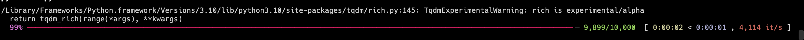

=========================
rich
=========================

关于进度条可参见: :ref:`ProgressInPy`

安装::

  pip install rich

与 :doc:`/docs/后端/python/python三方库/tqdm`
一起弄彩色进度条::

  from tqdm.rich import tqdm, trange

  def print_hi():
      n = 10000
      for i in trange(n):
          for j in range(n):
              j += i

效果

