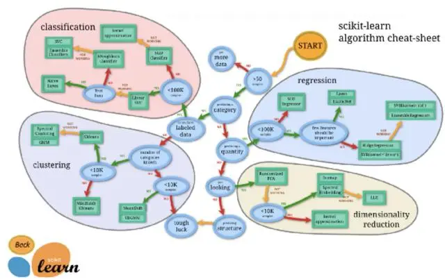
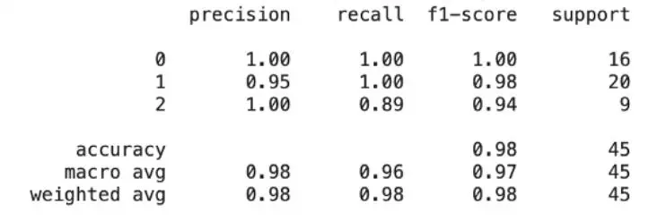
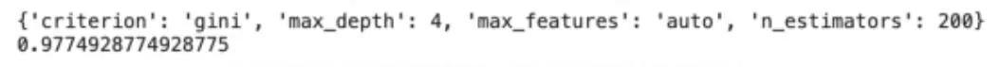

=====================================
简单使用教程
=====================================

.. post:: 2023-03-03 23:21:31
  :tags: python, python三方库, scikit-learn
  :category: 后端
  :author: YanQue
  :location: CD
  :language: zh-cn

以下将会使用 Wine 数据集, 可以直接代码下载::

  from sklearn.datasets import load_wine

  X,y = load_wine(return_X_y=True)

.. note::

  wine 使用函数下载: `sklearn.datasets.load_wine <https://scikit-learn.org/stable/modules/generated/sklearn.datasets.load_wine.html>`_

Estimators（估算器）
=====================================

Scitkit-learn 库提供了多种预构建算法，可以执行有监督和无监督的机器学习。它们通常被称为估算器。

为项目选择何种估计器取决于我们拥有的数据集和我们要解决的问题。
Scitkit-learn官方文档提供了如下所示的图表，可以帮助我们确定哪种算法适合我们的任务。

Scikit learn之所以能如此直接地使用，
是因为无论我们使用的模型或算法是什么，用于模型训练和预测的代码结构都是相同的。

假设我们正在处理一个回归问题，希望训练一个线性回归算法，并使用得到的模型进行预测。
使用Scikit learn 的第一步是调用 **logistic 回归估计器** 并将其另存为对象。
下面的示例调用该算法并将其保存为一个名为 lr 的对象::

  from sklearn.linear_model import LogisticRegression

  lr = LogisticRegression(max_iter=10000)

使用lr算法拟合数据, 这里设置参数10000是因为 :doc:`/docs/后端/python/python三方库/scikit-learn/问题/lbfgs failed to converge`

然后使用fit来训练数据获取模型::

  from sklearn.model_selection import train_test_split

  x_train, x_test, y_train, y_test = train_test_split(x, y, random_state=0)
  x_train, x_test, y_train, y_test
  model = lr.fit(x_train, y_train)

用得到的模型, 实验 测试数据集 效果::

  # 接下来，我们使用模型和预测（） 方法对以前不可见的数据进行预测。
  predictions = model.predict(x_test)
  predictions == y_test

输出::

  array([ True,  True,  True,  True,  True,  True,  True,  True,  True,
          True,  True,  True,  True,  True,  True,  True,  True,  True,
        False,  True,  True,  True,  True,  True,  True,  True,  True,
          True,  True,  True,  True,  True,  True,  True,  True,  True,
          True,  True,  True,  True,  True,  True,  True,  True,  True])

如果我们现在要使用 Scitkit-learn 执行不同的任务，
比如训练一个随机森林分类器。代码看起来非常相似，并且具有相同的步骤数::

  from sklearn.ensemble import RandomForestClassifier

  rf = RandomForestClassifier()
  rf_model = rf.fit(X_train, y_train)
  rf_predictions = rf_model.predict(X_test)

这种一致的代码结构使得开发机器学习模型非常直接，并且还生成高度可读和可重复的代码。

预处理
=====================================

在大多数实际机器学习项目中，我们使用的数据不一定准备好训练模型。
很可能首先需要执行一些数据预处理和转换步骤，
例如处理缺失值、将分类数据转换为数字或应用要素缩放。

Scikit-learn 具有执行这些预处理步骤的内置方法。
例如，SimpleImputer（） 会使用我们选择的方法来填充缺失的值::

  from sklearn.impute import SimpleImputer

  imputer = SimpleImputer(strategy='mean')
  X_train_clean = imputer.fit(X_train)

在 `Scikit-learn 官方文档-预处理 <https://scikit-learn.org/stable/modules/preprocessing.html>`_
中列出了数据预处理的完整选项

数据标准化和归一化
-------------------------------------

code::

  from sklearn.preprocessing import StandardScaler  # 标准化
  from sklearn.preprocessing import MinMaxScaler  # 归一化

  # 标准化
  ss = StandardScaler()
  X_scaled = ss.fit_transform(X_train)  # 传入待标准化的数据

  # 归一化
  mm = MinMaxScaler()
  X_scaled = mm.fit_transform(X_train)

模型评估
=====================================

衡量模型在预测新数据方面的好坏程度

此步骤称为模型评估，我们选择的度量将由我们希望解决的任务来确定。
例如，通常在回归问题中，我们可以选择RMSE，而对于分类，则可以选择 F1 分数。

所有估算器都包含一个 score（）方法，该方法返回与它们执行的机器学习任务最相关的默认指标.

比如上面的model::

  model.score(x_test, y_test)

  # 输出
  # 0.9777777777777777

Scikit-learn 还提供了一组指标函数，这些函数为模型提供了更详细的评估。
例如，对于分类任务，库具有分类报告，提供精度、召回、F1 评分和总体精度。

分类报告代码和输出如下所示::

  from sklearn.metrics import classification_report

  print(classification_report(rf_predictions, y_test))

模型优化
=====================================

Scikit-learn 库中的所有估算器都包含一系列参数，有多个选项，
为特定算法选择的值都将影响最终模型的性能。
例如，使用 RandomForestClass 表示器，
我们可以将树的 max_depth 设置为可能的任何值，
并且根据数据和任务的不同值，此参数的不同值将产生不同的结果。

这种尝试不同参数组合以找到最佳组合的过程称为超参数优化。

Scikit-learn 提供了两个自动执行此任务的工具，
GridSearchCV 实现了一种称为详尽网格搜索的技术，以及执行随机参数优化的随机搜索 CV。

下面的示例使用 GridSearchCV 查找随机森林分类器的最佳参数，输出结果在代码下方::

  param_grid = {
      'n_estimators': [200, 500],
      'max_features': ['auto', 'sqrt', 'log2'],
      'max_depth' : [4,5,6,7,8],
      'criterion' :['gini', 'entropy']
  }
  from sklearn.model_selection import GridSearchCV
  CV = GridSearchCV(rf, param_grid, n_jobs= 1)

  CV.fit(X_train, y_train)
  print(CV.best_params_)
  print(CV.best_score_)

管道
=====================================

Scikit-learn 包以管道的形式提供了一种更加方便的代码封装形式。
此工具允许将所有预处理任务与分类器步骤连接在一起，
以便简单地在单个管道对象上调用 fit（） 或 predict（） 执行工作流中的所有步骤。

这样可以生成高可读代码，并减少机器学习工作流中步骤的重复。

为了创建管道，我们首先在下面的代码中定义我称之为管道的对象中的步骤。
然后，我们可以简单地调用此对象的拟合来训练模型。此外，管道对象还可用于对新数据进行预测::

  from sklearn.pipeline import Pipeline
  pipe = Pipeline([('imputer', SimpleImputer()), ('rf', RandomForestClassifier())])
  pipeline_model = pipe.fit(X_train, y_train)
  pipeline_model.score(X_test, y_test)

