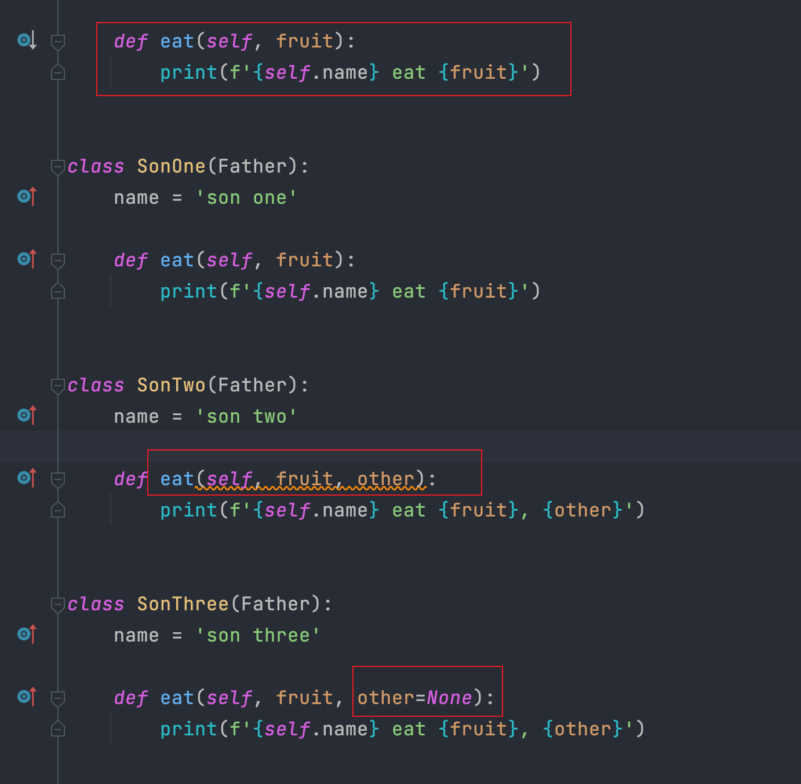

===================================
Python重写父类方法参数列表问题
===================================

.. post:: 2023-02-20 22:08:48
  :tags: python, 问题总结
  :category: 后端
  :author: YanQue
  :location: CD
  :language: zh-cn

介绍
===================================

使用 Pycharm 时, 当重写父类时, 若定义了不同的参数列表, 会出现警告.

这是因为: 由于增加了参数，从而改变了同父类方法的一致性违反了LSP原则（在使用父类的场景，替换为子类也一样可行）。

解决方式为，在子类重写的方法中为参数里添加默认值赋值，这样就确保了父类方法中定义的参数在子类中一定不会失效从而确保了自上而下的一致性。

	只可新增参数, 同时设定默认值

源码
===================================

.. literalinclude:: ../../../../../.test/override_.py
	:caption: 继承重写示例
	:language: python
