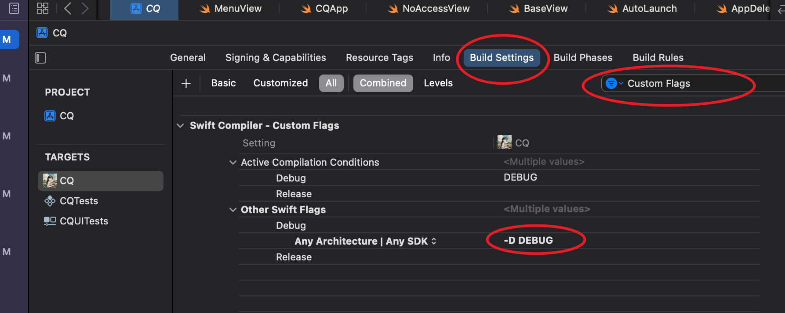

==============================
DEBUG条件
==============================

.. post:: 2023-02-20 22:06:49
  :tags: swift
  :category: 后端
  :author: YanQue
  :location: CD
  :language: zh-cn

用于设置如果是开发(DEBUG)中该做什么,
正式环境该做什么, 如::

  #if DEBUG
    print("可能没有获取到辅助权限, 确认后请清理后手动获取")
  #else
    // 打开请求辅助权限窗口
    let _ = NoAccessView().openInWindow(title: "请求授权", sender: self)
  #endif

如何配置?

打开, 程序配置页面, 选择 **Build Settings**, 然后可以在 **Filter** 中
搜索 **Custom Flags**

如图所示, 还需在 **Other Swift Flags** 中
设置 **Debug** 添加 **-D DEBUG** , 注意不要和Release一起添加

