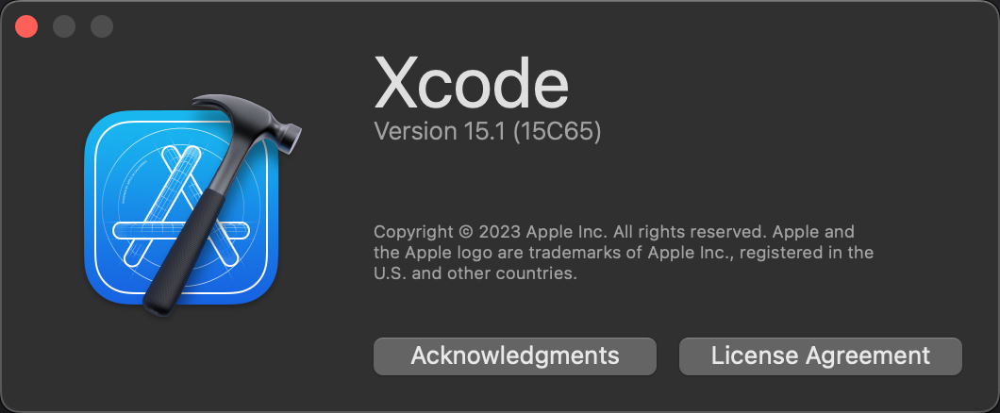
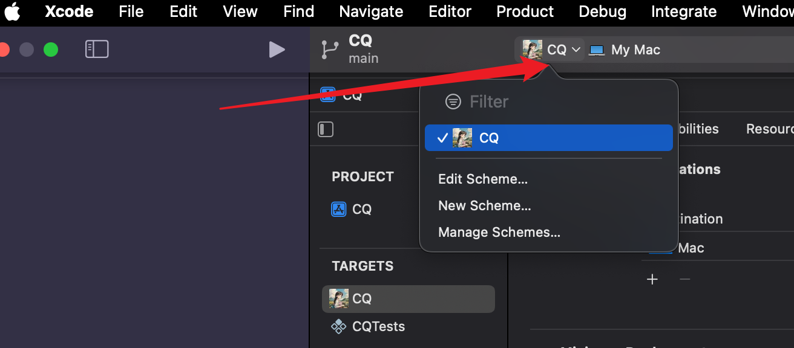
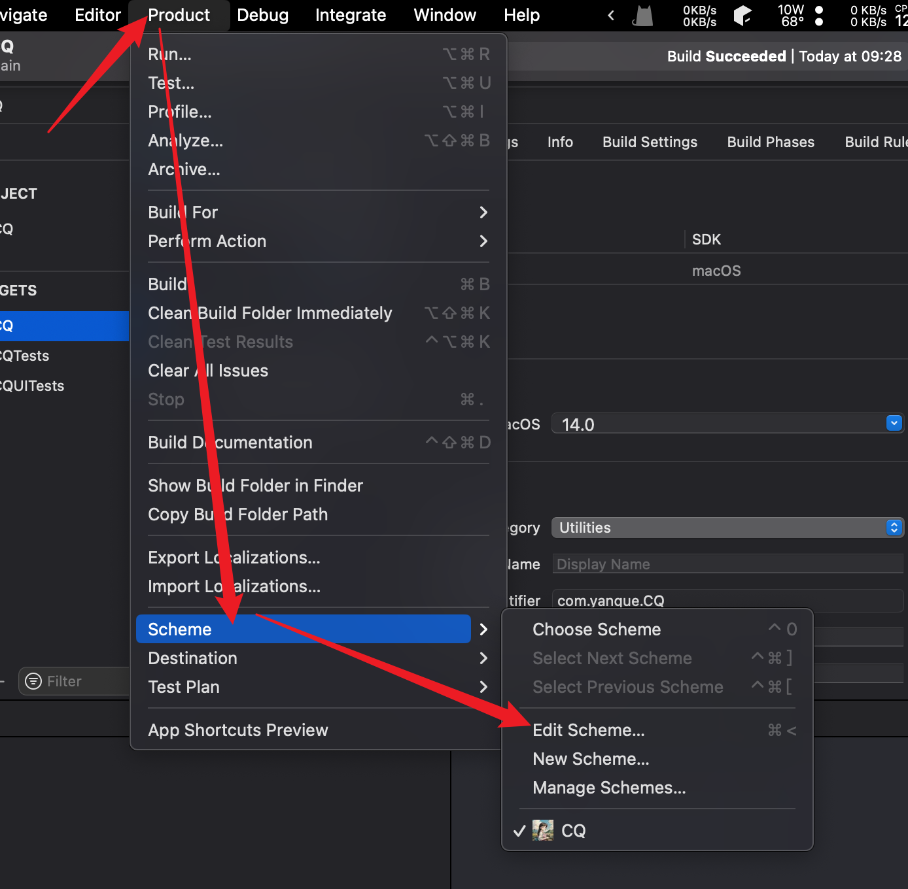
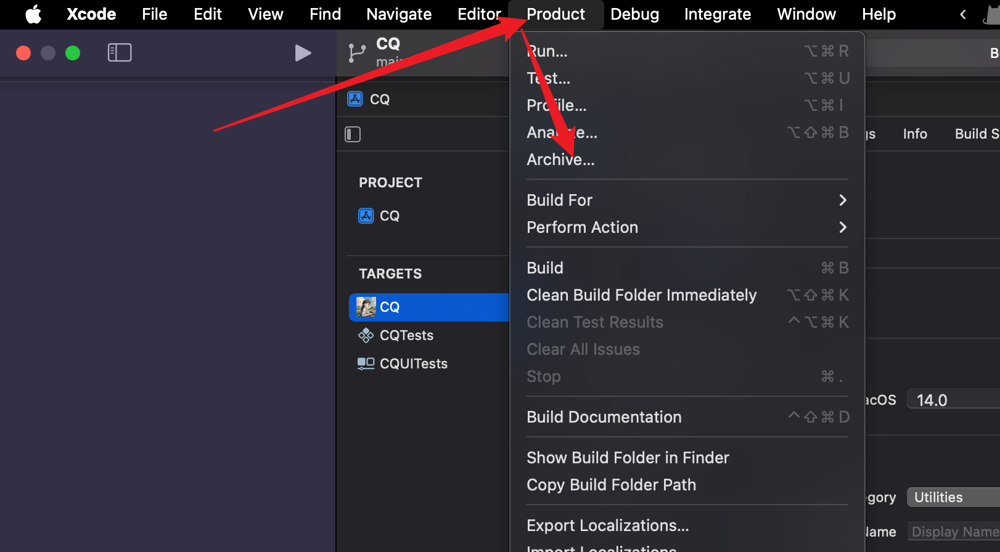
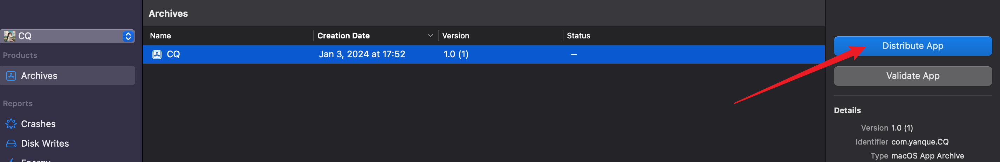
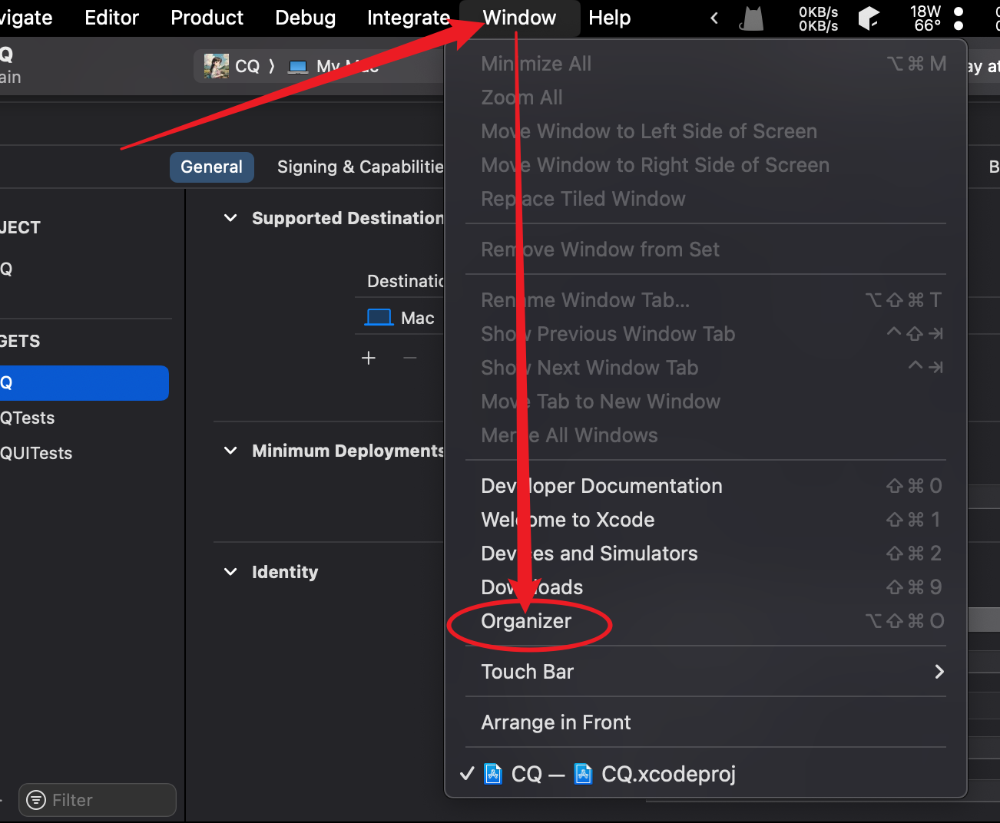
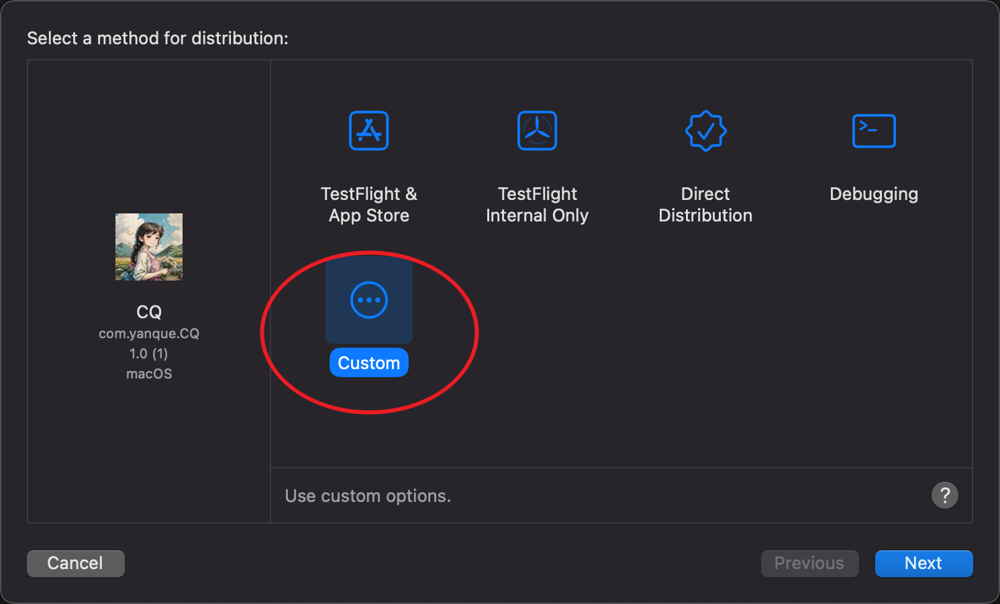
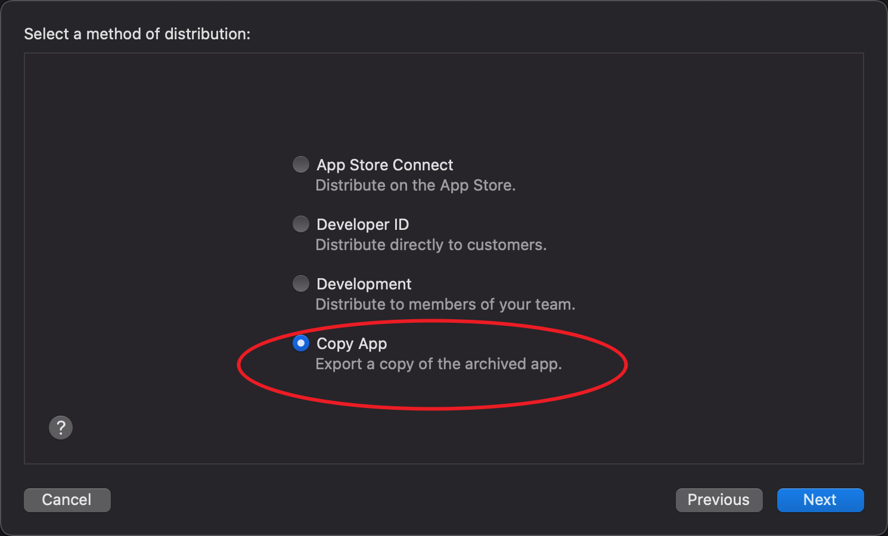

==========================
Xcode-分发打包
==========================

.. post:: 2023-02-20 22:06:49
  :tags: swift
  :category: 后端
  :author: YanQue
  :location: CD
  :language: zh-cn

Xcode版本: 15.1(15C65)

  当前版本

  在此位置编辑Schema

或者在 `Product - Schema` 编辑Schema

`Product - Archive` 进行打包

  打包位置

然后会进入 **Archive** 界面, 选择 **Distribute App**

注意, **Archive** 界面也可以通过 **Window - Organizer** 进入:

没购买官方开发者账号的就选 **Custom** 来导出副本到本地

正规App开发者账号上传后续可以参考: `https://zhuanlan.zhihu.com/p/583812511`

