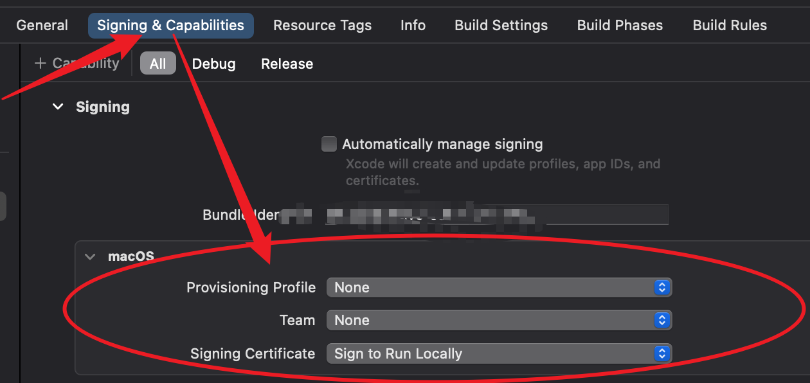
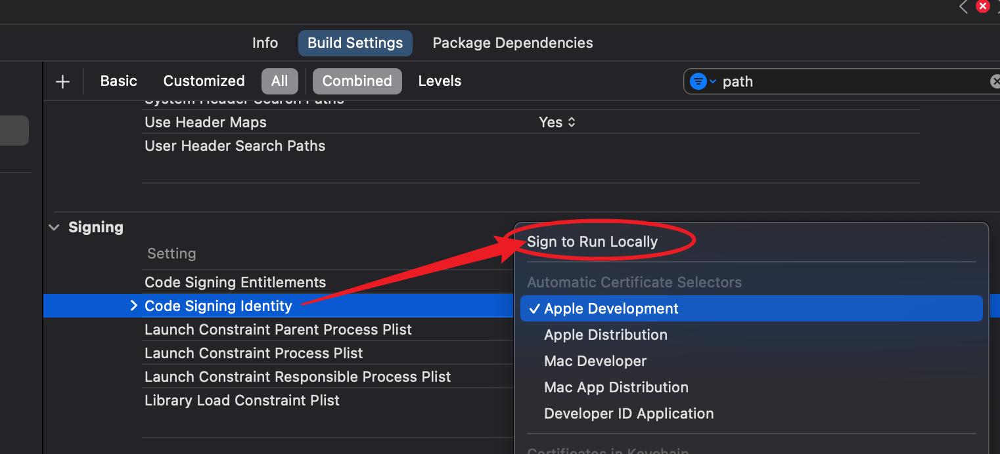

=============================
Xcode删除掉强制证书
=============================

Xcode删除掉强制证书/删除掉强制团队验证

先关闭掉xcode项目, 然后用文本编辑器比如vscode打开
项目配置文件 ``xxx.xcodeproj``, 全局搜索并更新为以下字段::

  # 这个这样改
  CODE_SIGN_STYLE = Manual;

  # 这些直接删除也可
  CODE_SIGN_IDENTITY = ""
  DEVELOPMENT_TEAM = ""
  PROVISIONING_PROFILE_SPECIFIER = "";

原来的内容也贴一下做个参考::

  CODE_SIGN_STYLE = Automatic;
  # 最主要就是这个和TEAM
  CODE_SIGN_IDENTITY = "Apple Development";
  DEVELOPMENT_TEAM = "";
  PROVISIONING_PROFILE_SPECIFIER = "";

.. note::

  不要在xcode项目打开的时候改, 不然会修改失败(多半会被内存中的覆盖掉)

重新打开xcode, 在 Target 中看看对不对, 不对就按这样选择

以及在 `build setting` 中的 `Signing` 设置下

.. note::

  顺便吐槽一句, xcode 太难用
