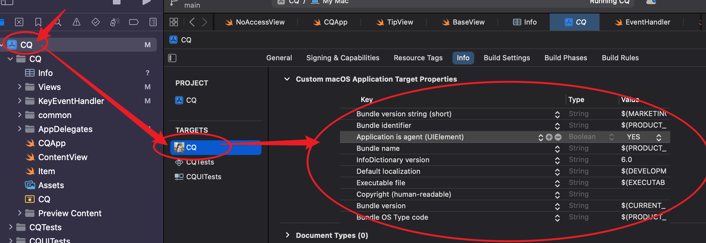
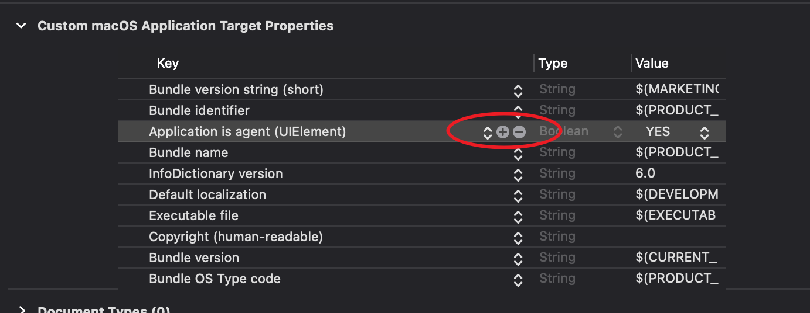

=========================
Xcode的Info配置
=========================

配置位置

这里配置时, 会自动新建一个info.plist文件.
若这里没有相应的选项, 那么可点击任意条目的 `+` 进行新增,
如图:

下面介绍常见条目作用

Application is agent (UIElement): boolean
  用来将应用程序设置为代理（agent）应用程序。
  应用程序将以无窗口的形式运行，并且不会在 Dock 中显示应用程序图标。

  通常用于实现后台任务、系统级别的服务或菜单栏应用程序等。
  代理应用程序在后台运行，不会干扰用户的工作流程，但仍然可以提供某些功能或服务。

  - 隐藏应用程序图标：设置应用程序为代理应用程序后，应用程序的图标将不会显示在 Dock 中，从而不会占用 Dock 的空间
  - 无窗口运行：代理应用程序通常不需要显示窗口，因此它们以无窗口的形式运行，不会在屏幕上显示用户界面。
  - 后台任务：代理应用程序可以在后台执行任务，例如监控系统事件、定时任务、网络请求等。
  - 系统级别的服务：代理应用程序可以提供系统级别的服务，例如全局快捷键监听、剪贴板操作、菜单栏扩展等。

  额外作用:

  - 窗口默认支持 **显示在其他全屏应用上方** (可能是因为属于系统级)

