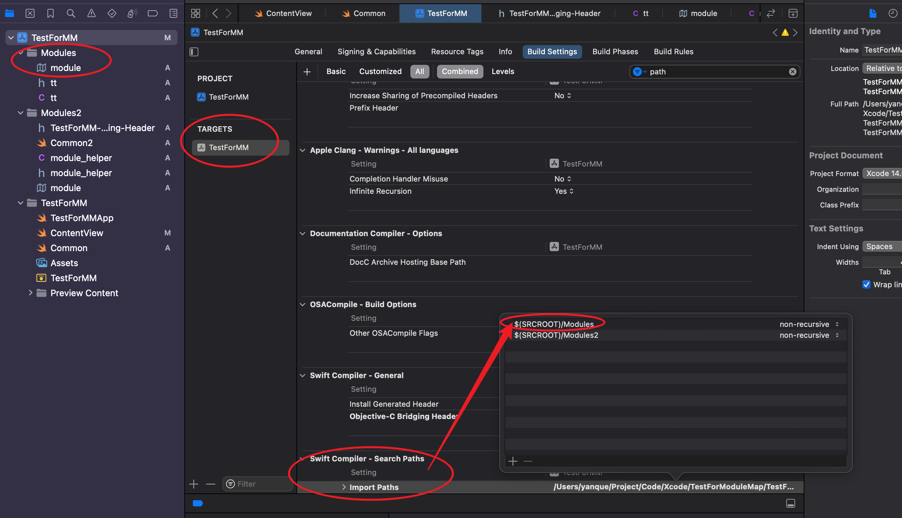

===========================================
使用modulemap导入C++框架
===========================================

.. post:: 2023-02-20 22:06:49
  :tags: swift
  :category: 后端
  :author: YanQue
  :location: CD
  :language: zh-cn

自己使用modulemap只导入某一个头文件,
文件是位于SDK库的 `libproc.h`, 奈何一直失败, 故放弃....

贴一些相关的资料:

- `Importing Headers from a C++ Package Target <https://www.swift.org/documentation/cxx-interop/project-build-setup/#importing-headers-from-a-c-package-target>`_
- `Mixing Languages in an Xcode project <https://developer.apple.com/documentation/swift/mixinglanguagesinanxcodeproject>`_
- `Importing C++ into Swift <https://www.swift.org/documentation/cxx-interop/#importing-c-into-swift>`_

反正是看了一圈, 好像没直接支持的,
如果要拿出来弄成target或者框架啥的, 就好麻烦,
毕竟只需要导那一个...,
暂时先桥接处理吧

使用modulemap
===========================================

**大致两步流程**

- 编写 modulemap 文件, 命名为 ``module.modulemap`` (在xcode新建会自带后缀)
- 在 ``TARGETS`` 下配置 ``Swift Compiler - Search Paths`` 为modulemap文件所在目录

**详细说明**

modulemap 不止可以使用在 C++, 也可以是C, 也不止是包和框架,
还可以直接在当前项目内直接新拉一个组用,
但是最重要的一点, **文件名只能定义为 `module`**

另外需配置 ``Swift Compiler - Search Paths`` 为modulemap文件所在目录,
以根目录下 `Modules/module.modulemap` 为例 (且一定要选 ``TARGETS`` 而不是 ``PROJECT``)::

  $(SRCROOT)/Modules

.. figure:、: ../../../resources/images/2024-01-29-14-29-14.png

.. important::

  modulemap文件名只能叫 module

module.modulemap内容示例::

  module ProcInfo {
      header "tt.h"
      export *
  }

**其他说明**

有个新的问题, 就是在自定义的头文件, 无法导入其他头文件并正常使用,
以导入SDK库的libproc为例::

  // tt.h
  #ifndef tt_h
  #define tt_h

  //#include <libproc.h>
  //#import <libproc.h>
  #import </Applications/Xcode.app/Contents/Developer/Platforms/MacOSX.platform/Developer/SDKs/MacOSX14.2.sdk/usr/include/libproc.h>

  // 不知道为啥, 就是找不到sdk包里面的 libproc...

  #define NAME "YQ"
  #define NAME2 "YQ"
  #define PROC_PIDPATHINFO_MAXSIZE PROC_PIDPATHINFO_MAXSIZE
  #define PROC_Q_MAXSIZE PROC_PIDPATHINFO_MAXSIZE
  #define SIZEYQ "PROC_PIDPATHINFO_MAXSIZE"

  #endif /* tt_h */

不管 ``import`` 怎么写, 不管在 header path怎么设置, 哪怕是直接导入绝对路径, ``cmd + click`` 都找不到...

最后尝试了一下在swift中使用, 发现一个问题,
就是虽然头文件中没发直接按住Command键并单击来导航到导入的头文件,
但是代码中可以拿到部分值

.. note::

  无法通过 按住Command键并单击来 自定义头文件中引入的头文件来确定是否成功导入,
  貌似根本没发在项目支持.

.. 所以还是用桥接头文件吧...

.. 不过桥接头文件也无法直接通过按住Command键并单击来导航到导入的头文件。
.. 这是因为桥接头文件是一个特殊的文件，用于连接Objective-C和Swift代码，Xcode无法直接识别和导航其中的导入语句。

