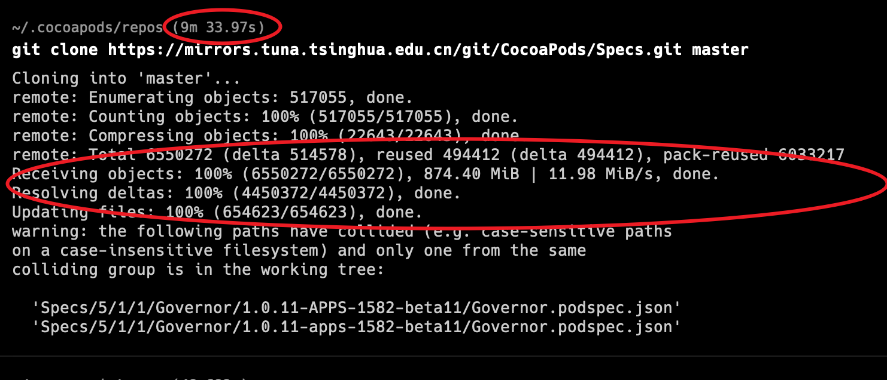

============================
包管理工具pod(cocoapods)
============================

.. post:: 2024-03-09 18:21:01
  :tags: swift
  :category: 后端
  :author: YanQue
  :location: CD
  :language: zh-cn

参考: https://juejin.cn/post/6932739864613879821

类似于Java的Maven

需要先有Ruby, 因为pod是用Ruby写的,
可参考: :doc:`/docs/后端/ruby/index`

安装::

  gem install cocoapods
  pod setup

配置镜像
============================

参考: https://mirrors.tuna.tsinghua.edu.cn/help/CocoaPods/

内容::

  CocoaPods 是一个 Cocoa 和 Cocoa Touch 框架的依赖管理器，具体原理和 Homebrew 有点类似，都是从 GitHub 下载索引，然后根据索引下载依赖的源代码。

  对于旧版的 CocoaPods 可以使用如下方法使用 tuna 的镜像：

  $ pod repo remove master
  $ pod repo add master https://mirrors.tuna.tsinghua.edu.cn/git/CocoaPods/Specs.git

  # 把所有上传到cocoapods的第三方框架下载每个版本和网络地址以及一些其他描述信息到本地
  $ pod repo update

  新版的 CocoaPods 不允许用pod repo add直接添加master库了，但是依然可以：

  $ cd ~/.cocoapods/repos
  $ pod repo remove master
  $ git clone https://mirrors.tuna.tsinghua.edu.cn/git/CocoaPods/Specs.git master
  最后进入自己的工程，在自己工程的podFile第一行加上：

  source 'https://mirrors.tuna.tsinghua.edu.cn/git/CocoaPods/Specs.git'

  克隆镜像有点慢, 我这花了9分半

Mac默认缓存位置是在: `/Users/用户名/.cocoapods/repos`

应该是pod转了一遍网络的原因, 导致github没有走clash的代理,
全局代理也无效; 只能手动配置一下了::

  git config --global http.https://github.com.proxy socks5://127.0.0.1:60742

还没试, 后面试试.

附, 恢复::

  git config --global --unset http.proxy 复制代码

  git config --global --unset http.https://github.com.proxy 复制代码

使用
============================

命令行方式::

  pod init

或者手动创建 **Podfile**::

  source 'https://mirrors.tuna.tsinghua.edu.cn/git/CocoaPods/Specs.git'

  platform :osx, '14.0'
  use_frameworks!

  target 'CQ' do
      pod 'KeyboardShortcuts', '~> 1.16.1'
  end

第一行指定源

后续安装直接::

  pod install 即可

.. note::

  这里用的 `KeyboardShortcuts` 发现pod上面版本只有 `0.7.1` , 太低了, 放弃

.. important::

  使用pod的项目, 一定要使用 ``项目名.xcworkspace`` 打开, 才是 pod 的配置,
  否则找不到pod安装的模块

