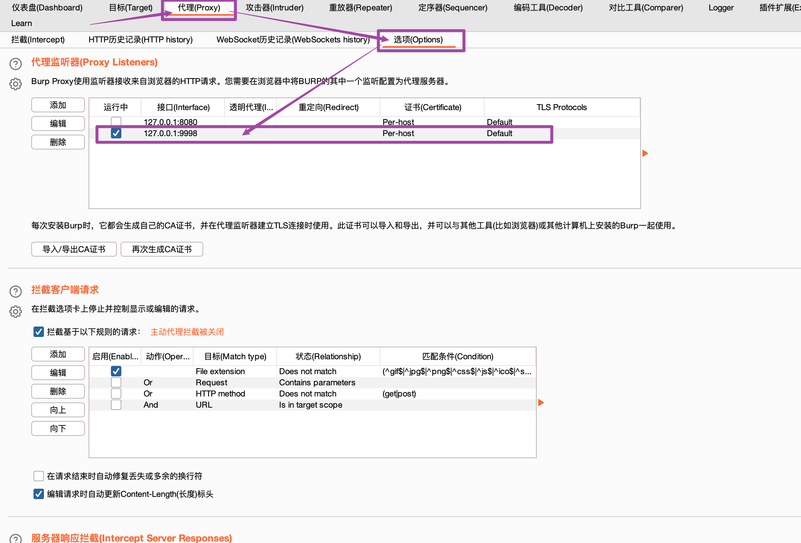
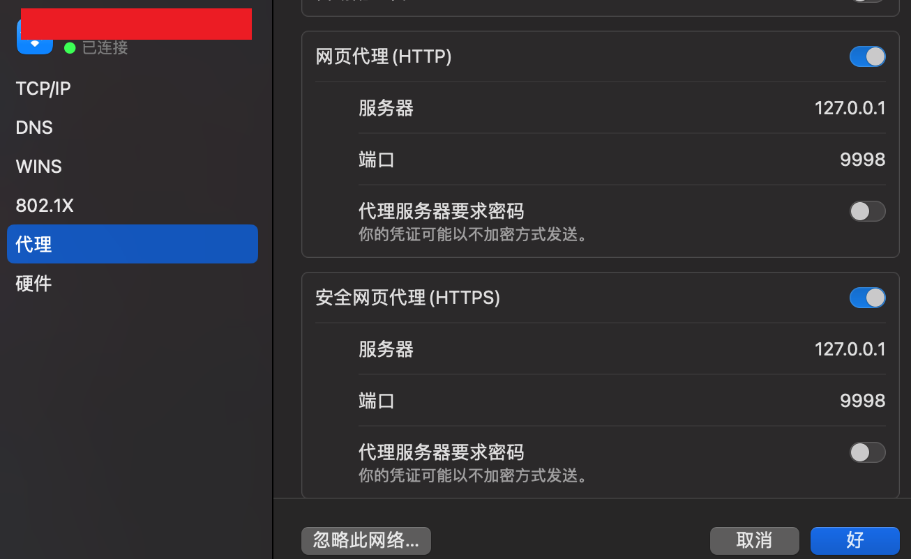
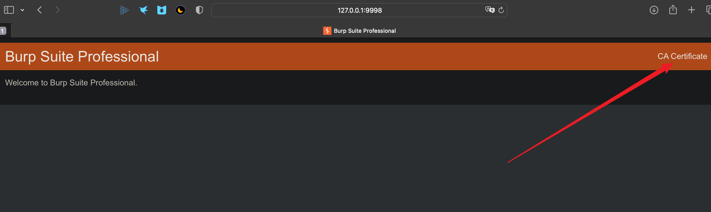
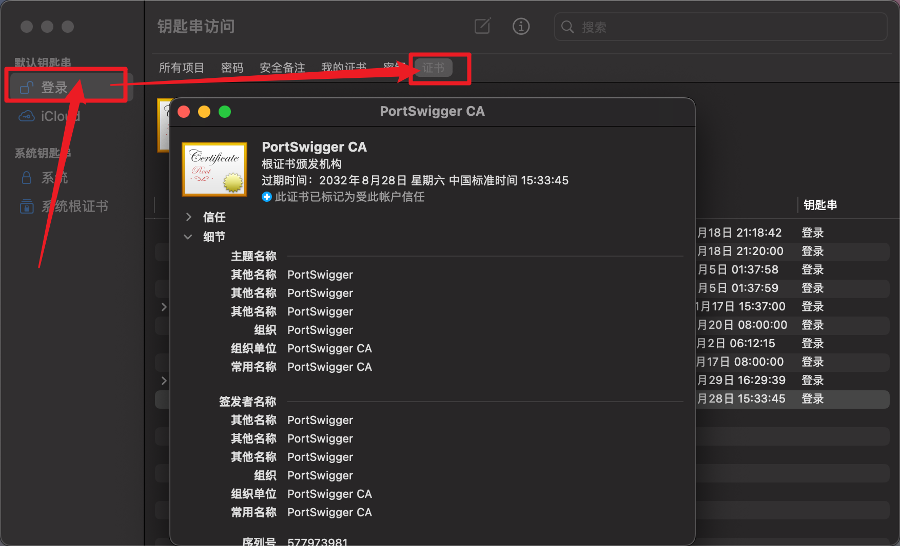

=========================
macos使用brup
=========================

.. post:: 2023-02-20 22:36:38
  :tags: brup
  :category: 安全
  :author: YanQue
  :location: CD
  :language: zh-cn

安装过程暂不表述, 主要是已经忘了

证书配置
=========================

系统: macOS 13

打开burp设置代理地址
-------------------------

  设置地址: 127.0.0.1:9998

设置浏览器代理地址
-------------------------

进入路径为 系统设置 -> wifi -> 详细信息 -> 网页代理

或者打开safari -> 偏好设置 -> 高级 -> 代理

  http和https都可以设置好

浏览器打开该地址下载证书
-------------------------

  点击右上角下载证书(可以重命名)

导入证书
-------------------------

comman + space 打开搜索, 找到 `钥匙串访问` 并打开, 进入 登录 -> 证书

  进入 登录 -> 证书

将下载好的证书拖动到此页面, 并设置为始终信任(选中右键 -> 显示简介 -> 始终信任)

之后就可以在burp进行拦截了.

