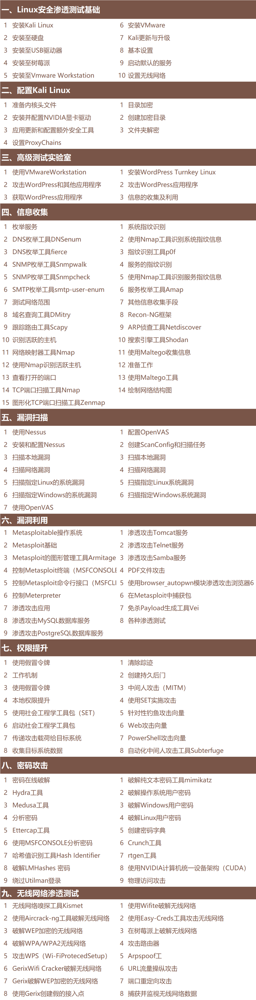

================================
安全
================================

.. toctree::
  :maxdepth: 1

  Python灰帽子
  kali/index
  生成TLS(SSL)证书
  一些备忘
  常见漏洞/index
  提权总结
  安全领域的AI
  渗透测试流程
  漏洞缺陷分类
  一些有用的网站
  brup/index
  学习记录/index
  逆向工程/index

大致路线

渗透
  单纯的攻击
渗透测试
  模拟渗透(有授权与限制, 保密等)

  还有 EDU SRC (教育渗透)

.. 渗透有哪些手段
.. ================================

.. - 服务器目录扫描
..   使用 :doc:`/docs/安全/brup/index`,
..   或者 :doc:`/docs/安全/kali/kali渗透专用指令/dirb`
.. - 指纹扫描 CMS(Content Management System)

..   .. figure:: ../../resources/images/2024-02-21-23-17-14.png
..     :width: 480px

..   可以理解为系统用了哪些框架及其版本

..   因为一般写个什么都是先去看看有没有什么开源的，
..   所以可以尝试找找有没有使用这些开源项目， 然后根据项目找漏洞

相关工具
================================

DVWA
  `<https://github.com/digininja/DVWA>`_

  通过简单明了的界面来练习一些最常见的 Web 漏洞，所练习的漏洞具有不同的难度级别。
  请注意，此软件存在提示和无提示的漏洞。 这是特意为止。
  我们鼓励您依靠自己的能力尝试并发现尽可能多的安全问题。

  clone地址::

    https://github.com/digininja/DVWA.git

  默认用户密码::

    admin
    password

  安装见 :doc:`/docs/安全/学习记录/DVWA靶场搭建`

