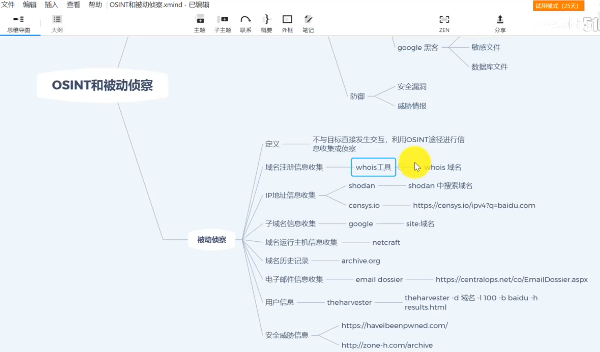
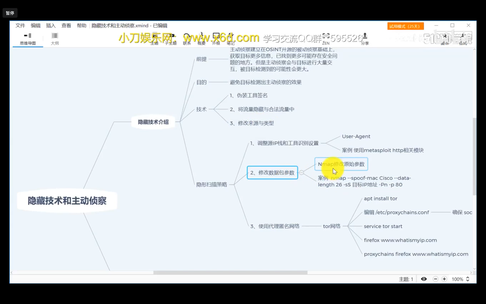
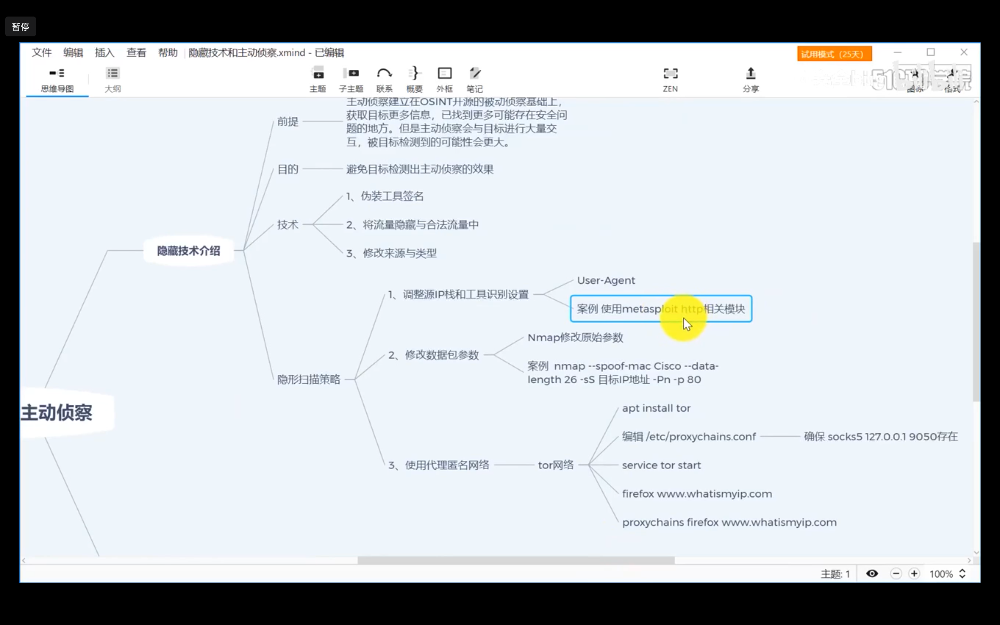
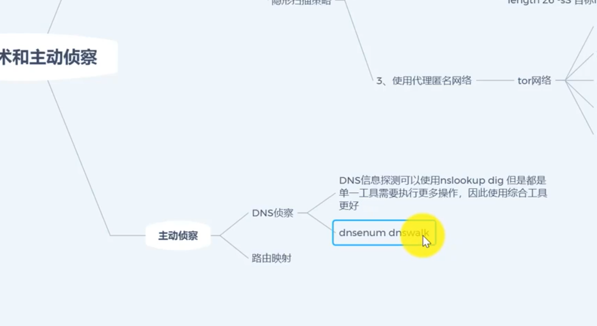
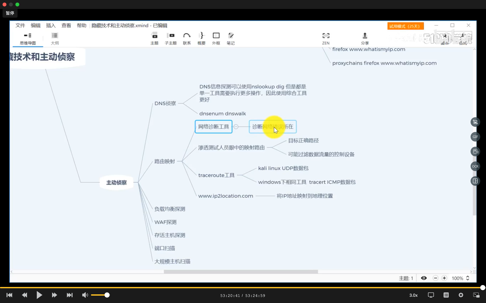
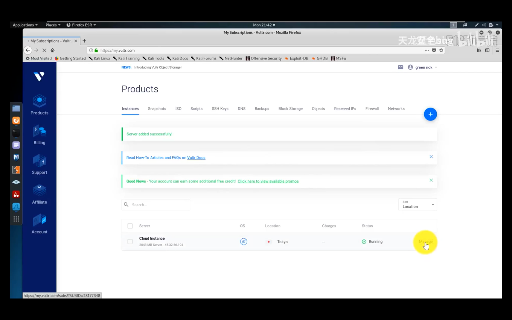

========================
Kali命令工具
========================

- nmap: IP/端口扫描
- maltego
- dirb: 服务目录扫描
- whatweb: 服务框架扫描, VUE啥的
- cmseek: 指纹扫描
- msfconsole: 交互式漏洞搜索工具
- hydra: 暴力破解帐密
- medusa: 暴力破解帐密
- sqlmap: 渗透数据库
- wpscan: 漏洞扫描
- strings: 以字符串形式 查看图片
- exiftool: 查看文件注释
- nc:
- nikto:
- wfuzz: 爆破
- whois: 域名注册信息收集
- shodan: IP地址信息收集
- tor: 使用代理伪装

有些其实本来就是linux指令, 但在普通场景下一般用不到,
所以放在此处.

.. :doc:`/docs/安全/kali/kali渗透专用指令/index`

.. toctree::
	:glob:

	kali渗透专用指令/*

	备忘,

	云服务器厂商. 国外

msf
========================

:doc:`msf/index`
