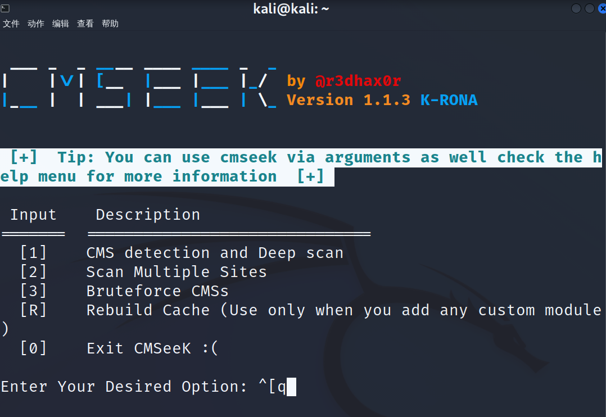

======================
cmseek
======================

.. post:: 2023-02-25 22:13:17
  :tags: kali, kali渗透专用指令
  :category: 安全
  :author: YanQue
  :location: CD
  :language: zh-cn

指纹扫描

在Kali中直接输入cmseek，启动该软件,
如果没有安装, 会提示y安装

不带参数默认进入交互式界面

用法::

  python3 cmseek.py (for guided scanning)
  cmseek (for guided scanning)
  python3 cmseek.py [OPTIONS] <Target Specification>
  cmseek [OPTIONS] <Target Specification>

指定 TARGET:
  -u URL, --url URL            Target Url
  -l LIST, --list LIST         文件路径, 内容为 url 路径集合, 以逗号分隔

扫描选项:
  -i cms, --ignore--cms cms    忽略指定的 CMS IDs 以避免失败. 以 comma "," 逗号分隔
  --strict-cms cms             只检查给定的 CMS IDs, 多个以逗号分隔
  --skip-scanned               如果CMS已经预探测过了, 跳过 target
  --light-scan                 跳过深度扫描. 即只探测CMS和版本
  -o, --only-cms               只探测CMS, 不进行深度扫描以及版本信息探测

重定向:
  --follow-redirect            需要进行的重定向
  --no-redirect                跳过所有的重定向

用户代理:
  -r, --random-agent           使用随机用户代理
  --googlebot                  Use Google bot user agent
  --user-agent USER_AGENT      自定义代理

输出:
  -v, --verbose                输出详细信息

版本:
  --version                    版本信息

HELP & 杂项(MISCELLANEOUS):
  -h, --help                   帮助
  --clear-result               删除所有扫描结果
  --batch                      扫描每一个site前, 不用手动 enter

用例::

  python3 cmseek.py -u example.com                           # 扫描 example.com
  python3 cmseek.py -l /home/user/target.txt                 # 扫描 target.txt 中指定的 sites (逗号分隔)
  python3 cmseek.py -u example.com --user-agent Mozilla 5.0  # 扫描 example.com, 且使用自定义用户代理(user-Agent): Mozilla is 5.0
  python3 cmseek.py -u example.com --random-agent            # 使用随机用户代理(user-Agent)扫描example.com
  python3 cmseek.py -v -u example.com                        # 查看扫描 example.com 的详细输出

示例
======================

.. code-block:: sh

  cmseek -u www.baidu.com

