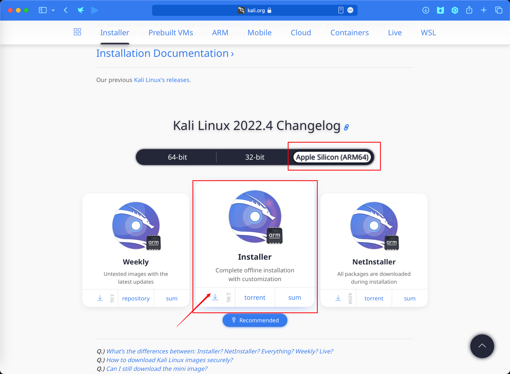
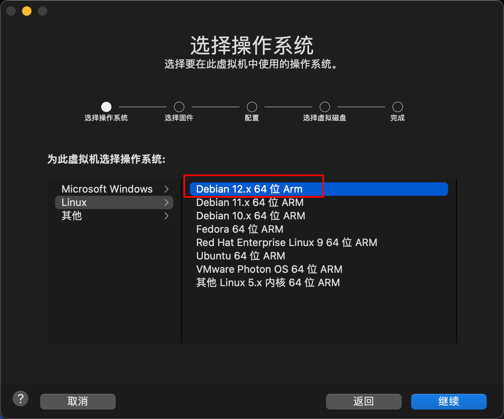

======================
Mac M1 Pro 安装 Kali
======================

.. post:: 2023-02-20 22:36:38
  :tags: kali
  :category: 安全
  :author: YanQue
  :location: CD
  :language: zh-cn

下载地址
======================

`Kali Installer <https://www.kali.org/get-kali/#kali-installer-images>`_

	Kali 下载位置

安装
======================

使用的工具是 *Vmware Fusion 13* , 可以申请免费许可证使用.

注意安装的时候选择 *Debain* 即可.

	选择 *Debian 12*

结束
======================

安装过程略过, 一路点就行.

注意因为是安装器手动安装, 所以需要自己设置用户名与密码.

与以前 *intel* 直接下载虚拟机版本点开即用的方式不一样.
